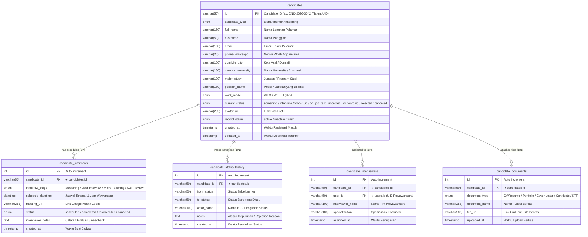

# 🧑‍💼 Database Mapping & ERD — Candidate Management (Dialogika)

> [!INFO] **Ringkasan Dokumen**
> Dokumen ini merupakan pemetaan rancangan database relasional (*Data Dictionary & Entity Relationship Diagram*) untuk modul **Candidate Management** pada platform internal Dialogika (`pilot.dialogika.co/candidate-management`).
> Modul ini memetakan seluruh siklus seleksi rekrutmen kandidat (Team, Mentor, dan Internship) menjadi **5 tabel relasional ternormalisasi (3NF)** dengan relasi One-to-Many ($1:N$) yang kokoh.

---

## 1. Visual Entity Relationship Diagram (ERD)

Diagram berikut menggambarkan tabel utama `candidates` dan 4 tabel relasi anak (*Child Tables*) yang terikat secara referensial melalui `candidate_id`:



---

## 2. Matriks Rincian Relasi Antar Tabel (Foreign Key Integrity)

Tabel berikut merangkum seluruh garis relasi panah yang menghubungkan tabel induk `candidates` dengan 4 tabel anak, termasuk aturan kardinalitas dan integritas referensial data:

| Tabel Asal (Parent) | Kardinalitas | Tabel Tujuan (Child) | Kunci Relasi (FK ➔ PK) | Aksi CASCADE | Deskripsi Hubungan Bisnis |
| :--- | :---: | :--- | :--- | :---: | :--- |
| **`candidates (id)`** | **$1 : N$** | **`candidate_interviews`** | `candidate_id ➔ candidates.id` | `ON DELETE CASCADE`<br/>`ON UPDATE CASCADE` | **Satu kandidat dapat memiliki beberapa sesi wawancara.** Meliputi screening, user interview, hingga micro teaching. |
| **`candidates (id)`** | **$1 : N$** | **`candidate_status_history`** | `candidate_id ➔ candidates.id` | `ON DELETE CASCADE`<br/>`ON UPDATE CASCADE` | **Satu kandidat memiliki riwayat perpindahan tahapan seleksi.** Menjamin audit trail lengkap status screening hingga onboarding atau penolakan. |
| **`candidates (id)`** | **$1 : N$** | **`candidate_interviewers`** | `candidate_id ➔ candidates.id` | `ON DELETE CASCADE`<br/>`ON UPDATE CASCADE` | **Satu kandidat dapat ditugaskan ke beberapa pewawancara.** Memetakan panel pewawancara lintas divisi (HR & User). |
| **`candidates (id)`** | **$1 : N$** | **`candidate_documents`** | `candidate_id ➔ candidates.id` | `ON DELETE CASCADE`<br/>`ON UPDATE CASCADE` | **Satu kandidat melampirkan banyak dokumen.** Menghubungkan file CV, portofolio karya, dan tugas uji coba pelamar. |

> [!TIP] **Integrasi Downstream di Ekosistem Dialogika**
> Ketika seorang kandidat dinyatakan **Accepted** dan siap bergabung:
> 1. **Modul Team Management (`/team-management`)**: Pelamar jalur *Team* dan *Internship* disinkronisasikan ke tabel `team_management` berdasarkan divisi terkait.
> 2. **Modul Mentor Management (`/mentor-management`)**: Pelamar jalur *Mentor* disinkronisasikan langsung ke koleksi master `mentors` lengkap dengan spesialisasi materi.
> 3. **Modul Users (`/users`)**: Tim HR dapat membuat akun internal resmi karyawan setelah tahap onboarding selesai.

---

## 3. Kamus Data Lengkap (Data Dictionary)

### A. Tabel Induk: `candidates`
Menampung identitas profil pelamar, jalur rekrutmen, pendidikan, posisi yang dilamar, dan status aktif seleksi.

| Nama Kolom | Tipe Data | Constraint | Penjelasan / Fungsi | Contoh Isi Data | Relasi / Arah Panah |
| :--- | :--- | :---: | :--- | :--- | :--- |
| **`id`** | `VARCHAR(50)` | **PK** | Kode unik identifikasi kandidat | `"CND-2026-0042"`, `"TLNT-8812"` | ➔ **Dihubungkan ke semua tabel child** |
| **`candidate_type`** | `ENUM` | NOT NULL | Jalur kandidat (`'team'`, `'mentor'`, `'internship'`) | `'team'` | - |
| **`full_name`** | `VARCHAR(150)` | NOT NULL | Nama lengkap kandidat sesuai identitas | `"Belva Shanna Azzahra"` | - |
| **`nickname`** | `VARCHAR(50)` | NULL | Nama panggilan akrab kandidat | `"Belva"` | - |
| **`email`** | `VARCHAR(100)` | NOT NULL | Alamat email resmi untuk persuratan | `"belva.shanna@email.com"` | - |
| **`phone_whatsapp`**| `VARCHAR(20)` | NULL | Nomor kontak WhatsApp aktif | `"+6281234567890"` | - |
| **`domicile_city`** | `VARCHAR(100)` | NULL | Kota domisili tempat tinggal saat ini | `"Yogyakarta"`, `"Jakarta Selatan"` | - |
| **`campus_university`**|`VARCHAR(150)`| NULL | Asal kampus / institusi pendidikan | `"Universitas Gadjah Mada"` | - |
| **`major_study`** | `VARCHAR(100)` | NULL | Jurusan / program studi perkuliahan | `"Ilmu Komunikasi"` | - |
| **`position_name`** | `VARCHAR(150)` | NOT NULL | Posisi atau formasi yang dilamar | `"Marketing Specialist"` | ➔ Merujuk ke master formasi |
| **`work_mode`** | `ENUM` | DEFAULT `'Hybrid'` | Preferensi cara kerja (`'WFO'`, `'WFH'`, `'Hybrid'`) | `'Hybrid'` | - |
| **`current_status`**| `ENUM` | DEFAULT `'screening'` | Status tahapan seleksi aktif | `'interview'`, `'accepted'` | - |
| **`avatar_url`** | `VARCHAR(255)` | NULL | Tautan URL foto profil pelamar | `"https://.../avatar-belva.webp"` | - |
| **`record_status`** | `ENUM` | DEFAULT `'active'` | Status dokumen (`'active'`, `'inactive'`, `'trash'`) | `'active'` | - |
| **`created_at`** | `TIMESTAMP` | CURRENT_TIMESTAMP | Waktu saat lamaran kandidat pertama kali masuk | `2026-10-04 09:00:00` | - |
| **`updated_at`** | `TIMESTAMP` | ON UPDATE CURRENT_TIMESTAMP | Waktu terakhir data kandidat dimodifikasi | `2026-10-04 10:15:00` | - |

---

### B. Tabel Sesi Wawancara: `candidate_interviews`
Menampung agenda wawancara, tahapan interview, link panggilan video, dan hasil evaluasi.

| Nama Kolom | Tipe Data | Constraint | Penjelasan / Fungsi | Contoh Isi Data | Relasi / Arah Panah |
| :--- | :--- | :---: | :--- | :--- | :--- |
| **`id`** | `INT(11)` | **PK, AI** | ID unik sesi wawancara | `1`, `2`, `3` | - |
| **`candidate_id`** | `VARCHAR(50)` | **FK** | ID kandidat pemilik agenda wawancara ini | `"CND-2026-0042"` | ➔ **Merujuk ke `candidates.id`** |
| **`interview_stage`**| `ENUM` | NOT NULL | Tahapan interview (`'Screening'`,`'User Interview'`,`'Micro Teaching'`,`'OJT Review'`) | `'User Interview'` | - |
| **`schedule_datetime`**|`DATETIME` | NOT NULL | Tanggal dan jam pelaksanaan wawancara | `2026-10-06 14:00:00` | - |
| **`meeting_url`** | `VARCHAR(255)` | NULL | Tautan Google Meet / Zoom Host | `"https://meet.google.com/abc-defg-hij"` | - |
| **`status`** | `ENUM` | DEFAULT `'scheduled'` | Status agenda (`'scheduled'`, `'completed'`, `'rescheduled'`, `'canceled'`) | `'scheduled'` | - |
| **`interviewer_notes`**|`TEXT` | NULL | Catatan penilaian dan rekomendasi pewawancara | `"Kandidat komunikatif, pemahaman copywriting sangat baik."` | - |
| **`created_at`** | `TIMESTAMP` | CURRENT_TIMESTAMP | Waktu pencatatan jadwal | `2026-10-04 10:00:00` | - |

---

### C. Tabel Log Status: `candidate_status_history`
Menampung rekam jejak audit (*audit trail*) perubahan status kandidat dari awal pendaftaran hingga tahap akhir.

| Nama Kolom | Tipe Data | Constraint | Penjelasan / Fungsi | Contoh Isi Data | Relasi / Arah Panah |
| :--- | :--- | :---: | :--- | :--- | :--- |
| **`id`** | `INT(11)` | **PK, AI** | ID unik log riwayat status | `1`, `2`, `3` | - |
| **`candidate_id`** | `VARCHAR(50)` | **FK** | ID kandidat bersangkutan | `"CND-2026-0042"` | ➔ **Merujuk ke `candidates.id`** |
| **`from_status`** | `VARCHAR(50)` | NOT NULL | Status tahapan sebelum perubahan | `"screening"` | - |
| **`to_status`** | `VARCHAR(50)` | NOT NULL | Status baru yang disematkan | `"interview"` | - |
| **`actor_name`** | `VARCHAR(100)` | NULL | Nama HR atau User yang mengeksekusi | `"Nabila HR Lead"` | - |
| **`notes`** | `TEXT` | NULL | Catatan pertimbangan, alasan lolos, atau alasan penolakan | `"Lolos verifikasi portofolio awal."` | - |
| **`created_at`** | `TIMESTAMP` | CURRENT_TIMESTAMP | Waktu aksi perubahan status dicatat | `2026-10-04 09:30:00` | - |

---

### D. Tabel Penugasan Pewawancara: `candidate_interviewers`
Menampung relasi tim penilai (*Interviewer Panel*) yang ditugaskan untuk mengevaluasi kandidat.

| Nama Kolom | Tipe Data | Constraint | Penjelasan / Fungsi | Contoh Isi Data | Relasi / Arah Panah |
| :--- | :--- | :---: | :--- | :--- | :--- |
| **`id`** | `INT(11)` | **PK, AI** | ID unik penugasan pewawancara | `1`, `2` | - |
| **`candidate_id`** | `VARCHAR(50)` | **FK** | ID kandidat yang dinilai | `"CND-2026-0042"` | ➔ **Merujuk ke `candidates.id`** |
| **`user_id`** | `VARCHAR(50)` | **FK** | UID user pewawancara dari master akun | `"USR-9921"` | ➔ Merujuk ke master `users.id` |
| **`interviewer_name`**|`VARCHAR(100)`| NOT NULL | Nama lengkap pewawancara | `"Dwi Prasetio, M.Psi"` | - |
| **`specialization`**| `VARCHAR(100)` | NULL | Spesialisasi bidang / divisi evaluator | `"Psychology & Culture Lead"` | - |
| **`assigned_at`** | `TIMESTAMP` | CURRENT_TIMESTAMP | Waktu penugasan pewawancara dilakukan | `2026-10-04 10:00:00` | - |

---

### E. Tabel Berkas Lampiran: `candidate_documents`
Menampung file pendukung seperti Resume/CV, Portofolio, Surat Rekomendasi, dan Sertifikat.

| Nama Kolom | Tipe Data | Constraint | Penjelasan / Fungsi | Contoh Isi Data | Relasi / Arah Panah |
| :--- | :--- | :---: | :--- | :--- | :--- |
| **`id`** | `INT(11)` | **PK, AI** | ID unik record berkas | `1`, `2` | - |
| **`candidate_id`** | `VARCHAR(50)` | **FK** | ID kandidat pemilik berkas | `"CND-2026-0042"` | ➔ **Merujuk ke `candidates.id`** |
| **`document_type`** | `ENUM` | NOT NULL | Kategori berkas (`'CV/Resume'`, `'Portfolio'`, `'Cover Letter'`, `'Certificate'`, `'KTP'`) | `'CV/Resume'` | - |
| **`document_name`** | `VARCHAR(255)` | NOT NULL | Judul / nama file lampiran | `"CV_Belva_Shanna_2026.pdf"` | - |
| **`file_url`** | `VARCHAR(500)` | NOT NULL | URL unduhan dokumen penyimpanan | `"https://storage.googleapis.com/.../cv.pdf"` | - |
| **`uploaded_at`** | `TIMESTAMP` | CURRENT_TIMESTAMP | Waktu dokumen diunggah ke sistem | `2026-10-04 09:00:00` | - |

---

## 4. MySQL DDL Script (Production Ready)

```sql
-- =====================================================================
-- DIALOGIKA CANDIDATE MANAGEMENT RELATIONAL SCHEMA (MySQL 8.0 / InnoDB)
-- =====================================================================

-- 1. TABEL UTAMA: candidates
CREATE TABLE IF NOT EXISTS `candidates` (
  `id` VARCHAR(50) NOT NULL,
  `candidate_type` ENUM('team', 'mentor', 'internship') NOT NULL DEFAULT 'team',
  `full_name` VARCHAR(150) NOT NULL,
  `nickname` VARCHAR(50) NULL,
  `email` VARCHAR(100) NOT NULL,
  `phone_whatsapp` VARCHAR(20) NULL,
  `domicile_city` VARCHAR(100) NULL,
  `campus_university` VARCHAR(150) NULL,
  `major_study` VARCHAR(100) NULL,
  `position_name` VARCHAR(150) NOT NULL,
  `work_mode` ENUM('WFO', 'WFH', 'Hybrid') NOT NULL DEFAULT 'Hybrid',
  `current_status` ENUM('screening', 'interview', 'follow_up', 'on_job_test', 'micro_teaching', 'accepted', 'onboarding', 'rejected', 'canceled') NOT NULL DEFAULT 'screening',
  `avatar_url` VARCHAR(255) NULL,
  `record_status` ENUM('active', 'inactive', 'trash') NOT NULL DEFAULT 'active',
  `created_at` TIMESTAMP NOT NULL DEFAULT CURRENT_TIMESTAMP,
  `updated_at` TIMESTAMP NOT NULL DEFAULT CURRENT_TIMESTAMP ON UPDATE CURRENT_TIMESTAMP,
  PRIMARY KEY (`id`),
  INDEX `idx_candidates_type_status` (`candidate_type`, `current_status`),
  INDEX `idx_candidates_email` (`email`)
) ENGINE=InnoDB DEFAULT CHARSET=utf8mb4;

-- 2. TABEL SESI WAWANCARA: candidate_interviews
CREATE TABLE IF NOT EXISTS `candidate_interviews` (
  `id` INT(11) NOT NULL AUTO_INCREMENT,
  `candidate_id` VARCHAR(50) NOT NULL,
  `interview_stage` ENUM('Screening', 'User Interview', 'Micro Teaching', 'OJT Review') NOT NULL DEFAULT 'Screening',
  `schedule_datetime` DATETIME NOT NULL,
  `meeting_url` VARCHAR(255) NULL,
  `status` ENUM('scheduled', 'completed', 'rescheduled', 'canceled') NOT NULL DEFAULT 'scheduled',
  `interviewer_notes` TEXT NULL,
  `created_at` TIMESTAMP NOT NULL DEFAULT CURRENT_TIMESTAMP,
  PRIMARY KEY (`id`),
  INDEX `idx_interviews_candidate` (`candidate_id`),
  INDEX `idx_interviews_schedule` (`schedule_datetime`),
  CONSTRAINT `fk_interviews_candidate` FOREIGN KEY (`candidate_id`)
    REFERENCES `candidates` (`id`) ON DELETE CASCADE ON UPDATE CASCADE
) ENGINE=InnoDB DEFAULT CHARSET=utf8mb4;

-- 3. TABEL RIWAYAT STATUS: candidate_status_history
CREATE TABLE IF NOT EXISTS `candidate_status_history` (
  `id` INT(11) NOT NULL AUTO_INCREMENT,
  `candidate_id` VARCHAR(50) NOT NULL,
  `from_status` VARCHAR(50) NOT NULL,
  `to_status` VARCHAR(50) NOT NULL,
  `actor_name` VARCHAR(100) NULL,
  `notes` TEXT NULL,
  `created_at` TIMESTAMP NOT NULL DEFAULT CURRENT_TIMESTAMP,
  PRIMARY KEY (`id`),
  INDEX `idx_history_candidate` (`candidate_id`),
  CONSTRAINT `fk_history_candidate` FOREIGN KEY (`candidate_id`)
    REFERENCES `candidates` (`id`) ON DELETE CASCADE ON UPDATE CASCADE
) ENGINE=InnoDB DEFAULT CHARSET=utf8mb4;

-- 4. TABEL PENUGASAN PEWAWANCARA: candidate_interviewers
CREATE TABLE IF NOT EXISTS `candidate_interviewers` (
  `id` INT(11) NOT NULL AUTO_INCREMENT,
  `candidate_id` VARCHAR(50) NOT NULL,
  `user_id` VARCHAR(50) NOT NULL,
  `interviewer_name` VARCHAR(100) NOT NULL,
  `specialization` VARCHAR(100) NULL,
  `assigned_at` TIMESTAMP NOT NULL DEFAULT CURRENT_TIMESTAMP,
  PRIMARY KEY (`id`),
  INDEX `idx_interviewers_candidate` (`candidate_id`),
  INDEX `idx_interviewers_user` (`user_id`),
  CONSTRAINT `fk_interviewers_candidate` FOREIGN KEY (`candidate_id`)
    REFERENCES `candidates` (`id`) ON DELETE CASCADE ON UPDATE CASCADE
) ENGINE=InnoDB DEFAULT CHARSET=utf8mb4;

-- 5. TABEL BERKAS LAMPIRAN: candidate_documents
CREATE TABLE IF NOT EXISTS `candidate_documents` (
  `id` INT(11) NOT NULL AUTO_INCREMENT,
  `candidate_id` VARCHAR(50) NOT NULL,
  `document_type` ENUM('CV/Resume', 'Portfolio', 'Cover Letter', 'Certificate', 'KTP') NOT NULL DEFAULT 'CV/Resume',
  `document_name` VARCHAR(255) NOT NULL,
  `file_url` VARCHAR(500) NOT NULL,
  `uploaded_at` TIMESTAMP NOT NULL DEFAULT CURRENT_TIMESTAMP,
  PRIMARY KEY (`id`),
  INDEX `idx_docs_candidate` (`candidate_id`),
  CONSTRAINT `fk_docs_candidate` FOREIGN KEY (`candidate_id`)
    REFERENCES `candidates` (`id`) ON DELETE CASCADE ON UPDATE CASCADE
) ENGINE=InnoDB DEFAULT CHARSET=utf8mb4;
```
