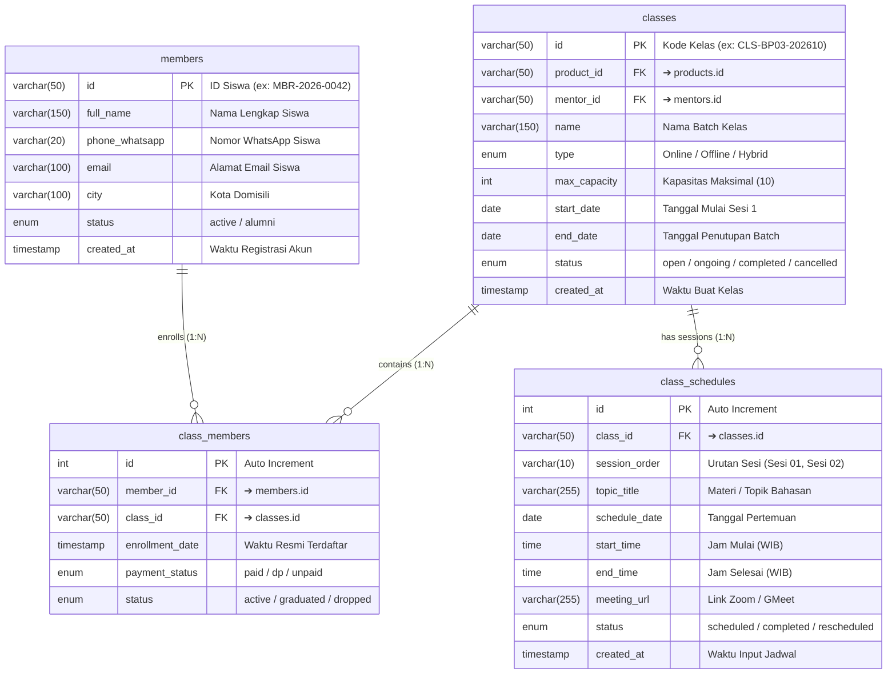

# 👥 Database Mapping & ERD — Member Data (Dialogika)

> [!INFO] **Ringkasan Dokumen**
> Dokumen ini memetakan rancangan database relasional (*Data Dictionary & Entity Relationship Diagram*) untuk modul **Member Data** pada platform Dialogika (`pilot.dialogika.co/member-data`).
> Modul ini mencakup siklus pengelolaan data siswa (*Master Siswa*), pendaftaran program kelas (*Enrollment Junction*), kelas yang diikuti (*Batch Classes*), serta jadwal sesi kelas (*Class Schedules*).

---

## 1. Visual Entity Relationship Diagram (ERD)

Diagram berikut merepresentasikan keterikatan antara profil siswa, pendaftaran kelas, dan jadwal sesi:



---

## 2. Matriks Relasi Antar Tabel (Foreign Key Integrity)

| Tabel Induk (Parent) | Kardinalitas | Tabel Anak (Child) | Kunci Penghubung | Aturan Delete / Update | Deskripsi Hubungan Bisnis |
| :--- | :--- | :--- | :--- | :--- | :--- |
| `members (id)` | **1 : N** | `class_members` | `member_id ➔ members.id` | **ON DELETE CASCADE** | 1 member siswa dapat mendaftar ke lebih dari satu program kelas. |
| `classes (id)` | **1 : N** | `class_members` | `class_id ➔ classes.id` | **ON DELETE CASCADE** | 1 batch kelas menampung banyak siswa terdaftar (relasi Many-to-Many). |
| `classes (id)` | **1 : N** | `class_schedules` | `class_id ➔ classes.id` | **ON DELETE CASCADE** | 1 batch kelas memiliki jadwal sesi belajar berulang secara berkala. |

---

## 3. Kamus Data (Data Dictionary)

### 3.1. Tabel `members` (Master Siswa)
- **Tujuan**: Menyimpan profil resmi peserta dan riwayat kontak utama.
- **Primary Key**: `id` (`VARCHAR(50)`)

| Nama Kolom | Tipe Data | Nullable | Default | Deskripsi | Contoh Nilai |
| :--- | :--- | :--- | :--- | :--- | :--- |
| `id` | `VARCHAR(50)` | NO | - | Primary Key format kode siswa | `"MBR-2026-0042"` |
| `full_name` | `VARCHAR(150)` | NO | - | Nama lengkap siswa | `"Siti Rahmawati"` |
| `phone_whatsapp` | `VARCHAR(20)` | NO | - | Nomor WhatsApp format internasional | `"6281234567890"` |
| `email` | `VARCHAR(100)` | YES | NULL | Alamat email aktif siswa | `"siti.rahma@gmail.com"` |
| `city` | `VARCHAR(100)` | YES | NULL | Kota domisili siswa | `"Yogyakarta"` |
| `status` | `ENUM('active','alumni')` | NO | `'active'` | Status keanggotaan aktif/alumni | `'active'` |
| `created_at` | `TIMESTAMP` | NO | `CURRENT_TIMESTAMP` | Waktu pendaftaran pertama kali | `2026-10-01 09:00:00` |

---

### 3.2. Tabel `class_members` (Pendaftaran Siswa ke Kelas — Junction M:N)
- **Tujuan**: Menghubungkan siswa dengan batch kelas yang diikutinya beserta status administrasi & pembayaran.
- **Primary Key**: `id` (`INT(11) AUTO_INCREMENT`)
- **Unique Key**: (`class_id`, `member_id`)

| Nama Kolom | Tipe Data | Nullable | Default | Deskripsi | Contoh Nilai |
| :--- | :--- | :--- | :--- | :--- | :--- |
| `id` | `INT(11)` | NO | AUTO_INC | Primary Key unik enrollment | `101` |
| `class_id` | `VARCHAR(50)` | NO | - | FK merujuk ke `classes.id` | `"CLS-BP03-202610"` |
| `member_id` | `VARCHAR(50)` | NO | - | FK merujuk ke `members.id` | `"MBR-2026-0042"` |
| `enrollment_date` | `TIMESTAMP` | NO | `CURRENT_TIMESTAMP` | Waktu siswa terdaftar di kelas | `2026-10-03 11:30:00` |
| `payment_status` | `ENUM('paid','dp','unpaid')` | NO | `'paid'` | Status kelunasan biaya kelas | `'paid'` |
| `status` | `ENUM('active','graduated','dropped')` | NO | `'active'` | Status partisipasi dalam batch | `'active'` |

---

### 3.3. Tabel `classes` (Master Batch Kelas)
- **Tujuan**: Menyimpan informasi pembukaan batch kelas pelatihan yang diikuti member.
- **Primary Key**: `id` (`VARCHAR(50)`)

| Nama Kolom | Tipe Data | Nullable | Default | Deskripsi | Contoh Nilai |
| :--- | :--- | :--- | :--- | :--- | :--- |
| `id` | `VARCHAR(50)` | NO | - | Kode batch unik kelas | `"CLS-BP03-202610"` |
| `product_id` | `VARCHAR(50)` | NO | - | FK merujuk ke `products.id` | `"BP-LVL-03"` |
| `mentor_id` | `VARCHAR(50)` | NO | - | FK merujuk ke `mentors.id` | `"MTR-001"` |
| `name` | `VARCHAR(150)` | NO | - | Label nama program batch kelas | `"Basic Plus Level 3 - Batch Oktober"` |
| `type` | `ENUM('Online','Offline','Hybrid')` | NO | `'Online'` | Format kelas | `'Online'` |
| `max_capacity` | `INT(11)` | NO | `10` | Batas kuota siswa maksimal | `10` |
| `start_date` | `DATE` | NO | - | Tanggal sesi pertemuan pertama | `2026-10-15` |
| `end_date` | `DATE` | NO | - | Tanggal penutupan batch | `2026-11-15` |
| `status` | `ENUM('open','ongoing','completed','cancelled')` | NO | `'open'` | Status operasional kelas | `'open'` |
| `created_at` | `TIMESTAMP` | NO | `CURRENT_TIMESTAMP` | Waktu data batch dibuat | `2026-10-03 10:00:00` |

---

### 3.4. Tabel `class_schedules` (Jadwal Sesi Pertemuan Kelas)
- **Tujuan**: Jadwal tanggal dan jam pelaksanaan tiap sesi pertemuan untuk siswa.
- **Primary Key**: `id` (`INT(11) AUTO_INCREMENT`)

| Nama Kolom | Tipe Data | Nullable | Default | Deskripsi | Contoh Nilai |
| :--- | :--- | :--- | :--- | :--- | :--- |
| `id` | `INT(11)` | NO | AUTO_INC | ID unik jadwal sesi | `501` |
| `class_id` | `VARCHAR(50)` | NO | - | FK merujuk ke `classes.id` | `"CLS-BP03-202610"` |
| `session_order` | `VARCHAR(10)` | NO | - | Nomor urutan pertemuan | `"Sesi 01"` |
| `topic_title` | `VARCHAR(255)` | NO | - | Judul materi yang diajarkan | `"Vocal Mastery & Articulation Drills"` |
| `schedule_date` | `DATE` | NO | - | Tanggal pelaksanaan sesi | `2026-10-18` |
| `start_time` | `TIME` | NO | - | Waktu mulai kelas | `19:30:00` |
| `end_time` | `TIME` | NO | - | Waktu selesai kelas | `21:00:00` |
| `meeting_url` | `VARCHAR(255)` | YES | NULL | Link ruang Zoom / Google Meet | `"https://zoom.us/j/9876543210"` |
| `status` | `ENUM('scheduled','completed','rescheduled')` | NO | `'scheduled'` | Status pelaksanaan jadwal sesi | `'scheduled'` |
| `created_at` | `TIMESTAMP` | NO | `CURRENT_TIMESTAMP` | Waktu pembuatan baris jadwal | `2026-10-03 10:00:00` |

---

## 4. Script MySQL DDL (Production Ready)

```sql
-- =======================================================
-- DIALOGIKA: MEMBER DATA, ENROLLMENT & CLASS MAPPING DDL
-- =======================================================

-- 1. TABEL MASTER SISWA: members
CREATE TABLE IF NOT EXISTS `members` (
  `id` VARCHAR(50) NOT NULL,
  `full_name` VARCHAR(150) NOT NULL,
  `phone_whatsapp` VARCHAR(20) NOT NULL,
  `email` VARCHAR(100) NULL,
  `city` VARCHAR(100) NULL,
  `status` ENUM('active', 'alumni') NOT NULL DEFAULT 'active',
  `created_at` TIMESTAMP NOT NULL DEFAULT CURRENT_TIMESTAMP,
  PRIMARY KEY (`id`)
) ENGINE=InnoDB DEFAULT CHARSET=utf8mb4;

-- 2. TABEL MASTER BATCH KELAS: classes
CREATE TABLE IF NOT EXISTS `classes` (
  `id` VARCHAR(50) NOT NULL,
  `product_id` VARCHAR(50) NOT NULL,
  `mentor_id` VARCHAR(50) NOT NULL,
  `name` VARCHAR(150) NOT NULL,
  `type` ENUM('Online', 'Offline', 'Hybrid') NOT NULL DEFAULT 'Online',
  `max_capacity` INT(11) NOT NULL DEFAULT 10,
  `start_date` DATE NOT NULL,
  `end_date` DATE NOT NULL,
  `status` ENUM('open', 'ongoing', 'completed', 'cancelled') NOT NULL DEFAULT 'open',
  `created_at` TIMESTAMP NOT NULL DEFAULT CURRENT_TIMESTAMP,
  PRIMARY KEY (`id`)
) ENGINE=InnoDB DEFAULT CHARSET=utf8mb4;

-- 3. TABEL PENDAFTARAN KELAS SISWA (JUNCTION M:N): class_members
CREATE TABLE IF NOT EXISTS `class_members` (
  `id` INT(11) NOT NULL AUTO_INCREMENT,
  `class_id` VARCHAR(50) NOT NULL,
  `member_id` VARCHAR(50) NOT NULL,
  `enrollment_date` TIMESTAMP NOT NULL DEFAULT CURRENT_TIMESTAMP,
  `payment_status` ENUM('paid', 'dp', 'unpaid') NOT NULL DEFAULT 'paid',
  `status` ENUM('active', 'graduated', 'dropped') NOT NULL DEFAULT 'active',
  PRIMARY KEY (`id`),
  UNIQUE KEY `uq_class_member` (`class_id`, `member_id`),
  INDEX `idx_class_members_class` (`class_id`),
  INDEX `idx_class_members_member` (`member_id`),
  CONSTRAINT `fk_class_members_class` FOREIGN KEY (`class_id`)
    REFERENCES `classes` (`id`) ON DELETE CASCADE ON UPDATE CASCADE,
  CONSTRAINT `fk_class_members_member` FOREIGN KEY (`member_id`)
    REFERENCES `members` (`id`) ON DELETE CASCADE ON UPDATE CASCADE
) ENGINE=InnoDB DEFAULT CHARSET=utf8mb4;

-- 4. TABEL PENJADWALAN SESI KELAS: class_schedules
CREATE TABLE IF NOT EXISTS `class_schedules` (
  `id` INT(11) NOT NULL AUTO_INCREMENT,
  `class_id` VARCHAR(50) NOT NULL,
  `session_order` VARCHAR(10) NOT NULL,
  `topic_title` VARCHAR(255) NOT NULL,
  `schedule_date` DATE NOT NULL,
  `start_time` TIME NOT NULL,
  `end_time` TIME NOT NULL,
  `meeting_url` VARCHAR(255) NULL,
  `status` ENUM('scheduled', 'completed', 'rescheduled') NOT NULL DEFAULT 'scheduled',
  `created_at` TIMESTAMP NOT NULL DEFAULT CURRENT_TIMESTAMP,
  PRIMARY KEY (`id`),
  INDEX `idx_schedules_class` (`class_id`),
  CONSTRAINT `fk_schedules_class` FOREIGN KEY (`class_id`)
    REFERENCES `classes` (`id`) ON DELETE CASCADE ON UPDATE CASCADE
) ENGINE=InnoDB DEFAULT CHARSET=utf8mb4;
```

---

## 5. Referensi Modul Terkait

Sesuai pembagian domain arsitektur Dialogika:
- **Product Management (Katalog Produk & Silabus):** Lihat [PRODUCT-DATABASE-MAPPING.md](file:///d:/MAGANG/pilot/docs/PRODUCT-DATABASE-MAPPING.md)
- **Mentor Management (Coach & Penjadwalan Mengajar):** Lihat [MENTOR-DATABASE-MAPPING.md](file:///d:/MAGANG/pilot/docs/MENTOR-DATABASE-MAPPING.md)
