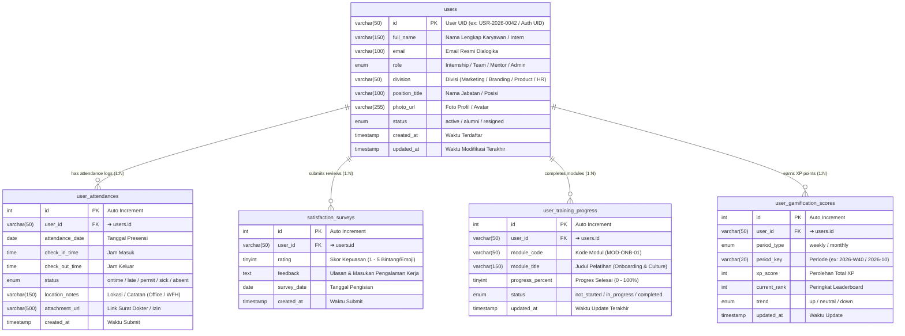

# 👥 Database Mapping & ERD — People Development (Dialogika)

> [!INFO] **Ringkasan Dokumen**
> Dokumen ini memetakan rancangan database relasional (*Data Dictionary & Entity Relationship Diagram*) untuk modul **People Development** pada platform internal Dialogika (`pilot.dialogika.co/people-development`).
> Modul ini mencakup ringkasan performa divisi, kehadiran tim/intern, survei kepuasan harian, perencanaan pelatihan (*Learning & Development*), serta papan peringkat (*Leaderboard Gamification*) yang terstruktur ke dalam **5 tabel relasional ternormalisasi (3NF)** dengan relasi One-to-Many ($1:N$) yang kokoh.

---

## 1. Visual Entity Relationship Diagram (ERD)

Diagram berikut merepresentasikan tabel induk `users` (profil tim/intern yang dibina) beserta 4 tabel relasi anak (*Child Tables*) yang terikat secara referensial melalui `user_id`:



---

## 2. Matriks Rincian Relasi Antar Tabel (Foreign Key Integrity)

Tabel berikut merangkum seluruh garis relasi panah yang menghubungkan tabel induk `users` dengan 4 tabel anak, termasuk aturan kardinalitas dan integritas data referensial:

| Tabel Asal (Parent) | Kardinalitas | Tabel Tujuan (Child) | Kunci Relasi (FK ➔ PK) | Aksi CASCADE | Deskripsi Hubungan Bisnis |
| :--- | :---: | :--- | :--- | :---: | :--- |
| **`users (id)`** | **$1 : N$** | **`user_attendances`** | `user_id ➔ users.id` | `ON DELETE CASCADE`<br/>`ON UPDATE CASCADE` | **Satu user memiliki banyak log kehadiran harian.** Menopang metrik Total Presensi, Total Absensi, dan tabel Log Kehadiran. |
| **`users (id)`** | **$1 : N$** | **`satisfaction_surveys`** | `user_id ➔ users.id` | `ON DELETE CASCADE`<br/>`ON UPDATE CASCADE` | **Satu user mengisi survei kepuasan berkala.** Menopang metrik Satisfaction Score (Index 4.8/5.0) dan formulir survei harian. |
| **`users (id)`** | **$1 : N$** | **`user_training_progress`** | `user_id ➔ users.id` | `ON DELETE CASCADE`<br/>`ON UPDATE CASCADE` | **Satu user mengikuti beberapa modul pelatihan.** Menopang kartu Training Progress (72%) dan bagian Detail Perencanaan Training. |
| **`users (id)`** | **$1 : N$** | **`user_gamification_scores`**| `user_id ➔ users.id` | `ON DELETE CASCADE`<br/>`ON UPDATE CASCADE` | **Satu user memiliki riwayat capaian poin XP gamifikasi.** Menopang tab Weekly & Monthly Leaderboard Gamification. |

> [!TIP] **Keterkaitan Antar Modul di Ekosistem Pilot**
> Modul People Development terhubung erat dengan modul lain di ekosistem Dialogika:
> 1. **Modul Presensi Mandiri (`/presence` & `/intern-presence`)**: Mengisi data harian ke tabel `user_attendances`.
> 2. **Modul Perizinan & Reimburse (`/permit-reimburse`)**: Memperbarui status presensi menjadi *permit* atau *sick* dengan berkas lampiran.
> 3. **Modul Candidate Management (`/candidate-management`)**: Kandidat yang *accepted* dan *onboarding* dimigrasikan ke tabel induk `users`.
> 4. **Modul Quest Board (`/quest`)**: Menyelesaikan quest harian menambah skor ke `user_gamification_scores`.

---

## 3. Kamus Data Lengkap (Data Dictionary)

### A. Tabel Induk: `users`
Menampung data identitas karyawan, intern, dan tim yang aktif dalam proses pengembangan SDM.

| Nama Kolom | Tipe Data | Constraint | Penjelasan / Fungsi | Contoh Isi Data | Relasi / Arah Panah |
| :--- | :--- | :---: | :--- | :--- | :--- |
| **`id`** | `VARCHAR(50)` | **PK** | UID autentikasi unik anggota/karyawan | `"USR-2026-0042"` | ➔ **Dihubungkan ke semua tabel child** |
| **`full_name`** | `VARCHAR(150)` | NOT NULL | Nama lengkap karyawan / intern | `"Dewi Lestari"` | - |
| **`email`** | `VARCHAR(100)` | NOT NULL | Alamat email resmi untuk notifikasi | `"dewi.lestari@dialogika.co"` | - |
| **`role`** | `ENUM` | NOT NULL | Peran akun (`'Internship'`, `'Team'`, `'Mentor'`, `'Admin'`) | `'Internship'` | - |
| **`division`** | `VARCHAR(50)` | NOT NULL | Divisi penugasan (`'Marketing'`, `'Branding'`, `'Product'`, `'HR'`) | `'Product'` | - |
| **`position_title`** | `VARCHAR(100)` | NOT NULL | Nama jabatan spesifik | `"UI/UX Designer Intern"` | - |
| **`photo_url`** | `VARCHAR(255)` | NULL | Tautan gambar avatar profil | `"https://dialogika.co/avatars/dewi.webp"` | - |
| **`status`** | `ENUM` | DEFAULT `'active'` | Status kepegawaian (`'active'`, `'alumni'`, `'resigned'`) | `'active'` | - |
| **`created_at`** | `TIMESTAMP` | CURRENT_TIMESTAMP | Waktu saat akun dibuat | `2026-10-01 08:00:00` | - |
| **`updated_at`** | `TIMESTAMP` | ON UPDATE CURRENT_TIMESTAMP | Waktu modifikasi terakhir | `2026-10-06 09:30:00` | - |

---

### B. Tabel Presensi & Kehadiran: `user_attendances`
Menampung rekam presensi harian karyawan dan intern untuk perhitungan persentase kehadiran dan absensi.

| Nama Kolom | Tipe Data | Constraint | Penjelasan / Fungsi | Contoh Isi Data | Relasi / Arah Panah |
| :--- | :--- | :---: | :--- | :--- | :--- |
| **`id`** | `INT(11)` | **PK, AI** | ID unik catatan presensi | `1`, `2`, `3` | - |
| **`user_id`** | `VARCHAR(50)` | **FK** | ID user yang melakukan presensi | `"USR-2026-0042"` | ➔ **Merujuk ke `users.id`** |
| **`attendance_date`** | `DATE` | NOT NULL | Tanggal sesi presensi | `2026-10-06` | - |
| **`check_in_time`** | `TIME` | NULL | Jam saat melakukan check-in masuk | `08:45:00` | - |
| **`check_out_time`** | `TIME` | NULL | Jam saat melakukan check-out keluar | `17:15:00` | - |
| **`status`** | `ENUM` | NOT NULL | Kategori status presensi (`'ontime'`, `'late'`, `'permit'`, `'sick'`, `'absent'`) | `'ontime'` | - |
| **`location_notes`** | `VARCHAR(150)` | NULL | Keterangan lokasi kerja / alasan | `"Office - Jakarta"`, `"WFH"` | - |
| **`attachment_url`** | `VARCHAR(500)` | NULL | Tautan surat dokter atau surat izin | `"https://storage.googleapis.com/.../surat.pdf"` | - |
| **`created_at`** | `TIMESTAMP` | CURRENT_TIMESTAMP | Waktu sistem merekam data presensi | `2026-10-06 08:45:02` | - |

---

### C. Tabel Survei Kepuasan: `satisfaction_surveys`
Menampung penilaian harian/mingguan dan ulasan kualitatif pengalaman kerja tim untuk menghitung indeks kepuasan (*Satisfaction Score*).

| Nama Kolom | Tipe Data | Constraint | Penjelasan / Fungsi | Contoh Isi Data | Relasi / Arah Panah |
| :--- | :--- | :---: | :--- | :--- | :--- |
| **`id`** | `INT(11)` | **PK, AI** | ID unik catatan survei | `1`, `2`, `3` | - |
| **`user_id`** | `VARCHAR(50)` | **FK** | ID user pengisi survei | `"USR-2026-0042"` | ➔ **Merujuk ke `users.id`** |
| **`rating`** | `TINYINT` | NOT NULL | Nilai skala emoji 1 sampai 5 (1=Buruk, 5=Sangat Puas) | `5` | - |
| **`feedback`** | `TEXT` | NULL | Catatan evaluasi, saran perbaikan, atau apresiasi | `"Suasana kolaborasi tim desain sangat suportif!"` | - |
| **`survey_date`** | `DATE` | NOT NULL | Tanggal saat survei diisi | `2026-10-06` | - |
| **`created_at`** | `TIMESTAMP` | CURRENT_TIMESTAMP | Waktu saat form survei disubmit | `2026-10-06 17:05:00` | - |

---

### D. Tabel Progres Pelatihan: `user_training_progress`
Menampung modul pelatihan (*Learning & Development*) yang ditugaskan kepada anggota serta persentase capaian penyelesaiannya.

| Nama Kolom | Tipe Data | Constraint | Penjelasan / Fungsi | Contoh Isi Data | Relasi / Arah Panah |
| :--- | :--- | :---: | :--- | :--- | :--- |
| **`id`** | `INT(11)` | **PK, AI** | ID unik rekam modul pelatihan | `1`, `2` | - |
| **`user_id`** | `VARCHAR(50)` | **FK** | ID user yang mengikuti pelatihan | `"USR-2026-0042"` | ➔ **Merujuk ke `users.id`** |
| **`module_code`** | `VARCHAR(50)` | NOT NULL | Kode modul materi pelatihan | `"MOD-ONB-01"` | - |
| **`module_title`** | `VARCHAR(150)` | NOT NULL | Judul materi silabus | `"Onboarding & Culture"` | - |
| **`progress_percent`**| `TINYINT` | NOT NULL | Persentase capaian pemahaman modul (0–100%) | `100` | - |
| **`status`** | `ENUM` | DEFAULT `'in_progress'` | Status penyelesaian (`'not_started'`, `'in_progress'`, `'completed'`) | `'completed'` | - |
| **`updated_at`** | `TIMESTAMP` | CURRENT_TIMESTAMP ON UPDATE CURRENT_TIMESTAMP | Waktu evaluasi modul terakhir | `2026-10-05 16:00:00` | - |

---

### E. Tabel Gamifikasi & Leaderboard: `user_gamification_scores`
Menampung skor perolehan Experience Points (XP) anggota untuk gamifikasi, menentukan ranking mingguan dan bulanan pada dashboard.

| Nama Kolom | Tipe Data | Constraint | Penjelasan / Fungsi | Contoh Isi Data | Relasi / Arah Panah |
| :--- | :--- | :---: | :--- | :--- | :--- |
| **`id`** | `INT(11)` | **PK, AI** | ID unik capaian gamifikasi | `1`, `2`, `3` | - |
| **`user_id`** | `VARCHAR(50)` | **FK** | ID user pemilik poin XP | `"USR-2026-0042"` | ➔ **Merujuk ke `users.id`** |
| **`period_type`** | `ENUM` | NOT NULL | Tipe filter waktu (`'weekly'`, `'monthly'`) | `'weekly'` | - |
| **`period_key`** | `VARCHAR(20)` | NOT NULL | Kunci periode spesifik (Tahun-Minggu atau Tahun-Bulan) | `"2026-W40"`, `"2026-10"` | - |
| **`xp_score`** | `INT(11)` | NOT NULL DEFAULT 0 | Akumulasi poin XP yang didapatkan | `2450` | - |
| **`current_rank`** | `INT(11)` | NOT NULL | Peringkat klasemen pada periode tersebut | `1` | - |
| **`trend`** | `ENUM` | DEFAULT `'neutral'` | Pergerakan peringkat (`'up'`, `'neutral'`, `'down'`) | `'up'` | - |
| **`updated_at`** | `TIMESTAMP` | CURRENT_TIMESTAMP ON UPDATE CURRENT_TIMESTAMP | Waktu saat skor disinkronkan | `2026-10-06 09:00:00` | - |

---

## 4. MySQL DDL Script (Production Ready)

```sql
-- =====================================================================
-- DIALOGIKA PEOPLE DEVELOPMENT RELATIONAL SCHEMA (MySQL 8.0 / InnoDB)
-- =====================================================================

-- 1. TABEL UTAMA: users
CREATE TABLE IF NOT EXISTS `users` (
  `id` VARCHAR(50) NOT NULL,
  `full_name` VARCHAR(150) NOT NULL,
  `email` VARCHAR(100) NOT NULL,
  `role` ENUM('Internship', 'Team', 'Mentor', 'Admin') NOT NULL DEFAULT 'Internship',
  `division` VARCHAR(50) NOT NULL,
  `position_title` VARCHAR(100) NOT NULL,
  `photo_url` VARCHAR(255) NULL,
  `status` ENUM('active', 'alumni', 'resigned') NOT NULL DEFAULT 'active',
  `created_at` TIMESTAMP NOT NULL DEFAULT CURRENT_TIMESTAMP,
  `updated_at` TIMESTAMP NOT NULL DEFAULT CURRENT_TIMESTAMP ON UPDATE CURRENT_TIMESTAMP,
  PRIMARY KEY (`id`),
  INDEX `idx_users_role_status` (`role`, `status`),
  INDEX `idx_users_division` (`division`),
  INDEX `idx_users_email` (`email`)
) ENGINE=InnoDB DEFAULT CHARSET=utf8mb4;

-- 2. TABEL LOG KEHADIRAN: user_attendances
CREATE TABLE IF NOT EXISTS `user_attendances` (
  `id` INT(11) NOT NULL AUTO_INCREMENT,
  `user_id` VARCHAR(50) NOT NULL,
  `attendance_date` DATE NOT NULL,
  `check_in_time` TIME NULL,
  `check_out_time` TIME NULL,
  `status` ENUM('ontime', 'late', 'permit', 'sick', 'absent') NOT NULL DEFAULT 'ontime',
  `location_notes` VARCHAR(150) NULL,
  `attachment_url` VARCHAR(500) NULL,
  `created_at` TIMESTAMP NOT NULL DEFAULT CURRENT_TIMESTAMP,
  PRIMARY KEY (`id`),
  INDEX `idx_attendances_user` (`user_id`),
  INDEX `idx_attendances_date` (`attendance_date`),
  INDEX `idx_attendances_status` (`status`),
  CONSTRAINT `fk_attendances_user` FOREIGN KEY (`user_id`)
    REFERENCES `users` (`id`) ON DELETE CASCADE ON UPDATE CASCADE
) ENGINE=InnoDB DEFAULT CHARSET=utf8mb4;

-- 3. TABEL SURVEI KEPUASAN: satisfaction_surveys
CREATE TABLE IF NOT EXISTS `satisfaction_surveys` (
  `id` INT(11) NOT NULL AUTO_INCREMENT,
  `user_id` VARCHAR(50) NOT NULL,
  `rating` TINYINT NOT NULL DEFAULT 5,
  `feedback` TEXT NULL,
  `survey_date` DATE NOT NULL,
  `created_at` TIMESTAMP NOT NULL DEFAULT CURRENT_TIMESTAMP,
  PRIMARY KEY (`id`),
  INDEX `idx_surveys_user` (`user_id`),
  INDEX `idx_surveys_date` (`survey_date`),
  INDEX `idx_surveys_rating` (`rating`),
  CONSTRAINT `fk_surveys_user` FOREIGN KEY (`user_id`)
    REFERENCES `users` (`id`) ON DELETE CASCADE ON UPDATE CASCADE
) ENGINE=InnoDB DEFAULT CHARSET=utf8mb4;

-- 4. TABEL PROGRES PELATIHAN: user_training_progress
CREATE TABLE IF NOT EXISTS `user_training_progress` (
  `id` INT(11) NOT NULL AUTO_INCREMENT,
  `user_id` VARCHAR(50) NOT NULL,
  `module_code` VARCHAR(50) NOT NULL,
  `module_title` VARCHAR(150) NOT NULL,
  `progress_percent` TINYINT NOT NULL DEFAULT 0,
  `status` ENUM('not_started', 'in_progress', 'completed') NOT NULL DEFAULT 'in_progress',
  `updated_at` TIMESTAMP NOT NULL DEFAULT CURRENT_TIMESTAMP ON UPDATE CURRENT_TIMESTAMP,
  PRIMARY KEY (`id`),
  INDEX `idx_training_user` (`user_id`),
  INDEX `idx_training_module` (`module_code`),
  CONSTRAINT `fk_training_user` FOREIGN KEY (`user_id`)
    REFERENCES `users` (`id`) ON DELETE CASCADE ON UPDATE CASCADE
) ENGINE=InnoDB DEFAULT CHARSET=utf8mb4;

-- 5. TABEL GAMIFIKASI & LEADERBOARD: user_gamification_scores
CREATE TABLE IF NOT EXISTS `user_gamification_scores` (
  `id` INT(11) NOT NULL AUTO_INCREMENT,
  `user_id` VARCHAR(50) NOT NULL,
  `period_type` ENUM('weekly', 'monthly') NOT NULL DEFAULT 'weekly',
  `period_key` VARCHAR(20) NOT NULL,
  `xp_score` INT(11) NOT NULL DEFAULT 0,
  `current_rank` INT(11) NOT NULL DEFAULT 1,
  `trend` ENUM('up', 'neutral', 'down') NOT NULL DEFAULT 'neutral',
  `updated_at` TIMESTAMP NOT NULL DEFAULT CURRENT_TIMESTAMP ON UPDATE CURRENT_TIMESTAMP,
  PRIMARY KEY (`id`),
  INDEX `idx_gamification_user` (`user_id`),
  INDEX `idx_gamification_period` (`period_type`, `period_key`),
  CONSTRAINT `fk_gamification_user` FOREIGN KEY (`user_id`)
    REFERENCES `users` (`id`) ON DELETE CASCADE ON UPDATE CASCADE
) ENGINE=InnoDB DEFAULT CHARSET=utf8mb4;
```
