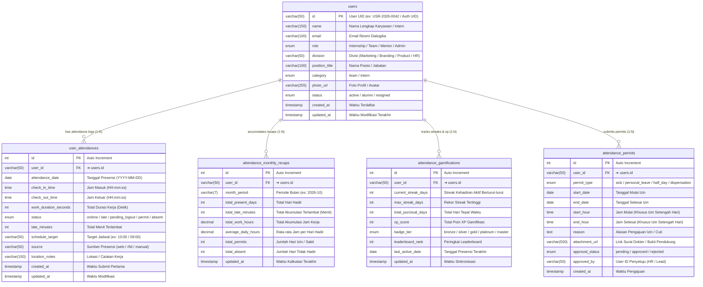

# ⏱️ Database Mapping & ERD — Team Presence (Dialogika)

> [!INFO] **Ringkasan Dokumen**
> Dokumen ini memetakan rancangan database relasional (*Data Dictionary & Entity Relationship Diagram*) untuk modul **Presensi Team** pada platform internal Dialogika (`pilot.dialogika.co/presence-team`).
> Modul ini mencakup pemantauan jam masuk (*clock in*) & jam keluar (*clock out*) *realtime*, kalkulasi otomatis keterlambatan terjadwal, akumulasi rekapitulasi jam kerja bulanan, peringkat gamifikasi & *streaks*, serta integrasi surat izin/cuti/dispensasi (*Permits*) yang terstruktur ke dalam **5 tabel relasional ternormalisasi (3NF)** dengan relasi One-to-Many ($1:N$) yang kokoh.

---

## 1. Visual Entity Relationship Diagram (ERD)

Diagram berikut merepresentasikan tabel induk `users` (profil tim/intern aktif) beserta 4 tabel relasi anak (*Child Tables*) yang terikat secara referensial melalui `user_id`:



---

## 2. Matriks Rincian Relasi Antar Tabel (Foreign Key Integrity)

Tabel berikut merangkum seluruh garis relasi panah yang menghubungkan tabel induk `users` dengan 4 tabel anak, termasuk aturan kardinalitas dan integritas data referensial:

| Tabel Asal (Parent) | Kardinalitas | Tabel Tujuan (Child) | Kunci Relasi (FK ➔ PK) | Aksi CASCADE | Deskripsi Hubungan Bisnis |
| :--- | :---: | :--- | :--- | :---: | :--- |
| **`users (id)`** | **$1 : N$** | **`user_attendances`** | `user_id ➔ users.id` | `ON DELETE CASCADE`<br/>`ON UPDATE CASCADE` | **Satu user memiliki banyak catatan log presensi harian.** Menopang Tabel Presensi Harian, status keterlambatan, clock-in, dan clock-out. |
| **`users (id)`** | **$1 : N$** | **`attendance_monthly_recaps`** | `user_id ➔ users.id` | `ON DELETE CASCADE`<br/>`ON UPDATE CASCADE` | **Satu user memiliki banyak ringkasan rekapitulasi bulanan.** Menopang Tabel Rekap Bulanan dan ekspor akumulasi bulanan. |
| **`users (id)`** | **$1 : N$** | **`attendance_gamifications`** | `user_id ➔ users.id` | `ON DELETE CASCADE`<br/>`ON UPDATE CASCADE` | **Satu user memiliki catatan progres gamifikasi presensi.** Menopang Tabel Total Jam, kalkulasi streak aktif, badge tier, dan leaderboard. |
| **`users (id)`** | **$1 : N$** | **`attendance_permits`** | `user_id ➔ users.id` | `ON DELETE CASCADE`<br/>`ON UPDATE CASCADE` | **Satu user dapat mengajukan banyak perizinan.** Menopang integrasi status izin/sakit pada kartu KPI dan presensi harian. |

> [!TIP] **Keterkaitan Antar Modul di Ekosistem Dialogika**
> Di luar modul Presensi Team, skema ini terintegrasi erat dengan modul lain:
> 1. **Modul Presensi Mandiri (`/presence` & `/intern-presence`)**: Merupakan pintu masuk *clock-in* dan *clock-out* yang mengisi baris ke tabel `user_attendances`.
> 2. **Modul Perizinan & Reimburse (`/permit-reimburse`)**: Menangani alur persetujuan surat izin/cuti (`attendance_permits`) oleh HR Division.
> 3. **Modul People Development (`/people-development`)**: Menggunakan metrik agregat kehadiran dan gamifikasi untuk evaluasi performa talenta.
> 4. **Modul Evaluasi Kinerja (`/performance-appraisal`)**: Mengambil data rekap bulanan untuk penilaian kedisiplinan semesteran.

---

## 3. Kamus Data Lengkap (Data Dictionary 3NF)

### A. Tabel Induk: `users`
Tabel master identitas personil Dialogika (karyawan tetap, tim magang, mentor, dan admin).

| Nama Kolom | Tipe Data | Kunci / Atribut | Nullable | Nilai Default | Deskripsi Kolom |
| :--- | :--- | :---: | :---: | :---: | :--- |
| `id` | `varchar(50)` | **PK** | Tidak | - | Identifier unik personil (Firebase Auth UID / Kode Pegawai). |
| `name` | `varchar(150)` | - | Tidak | - | Nama lengkap resmi personil. |
| `email` | `varchar(100)` | **Unique** | Tidak | - | Alamat email resmi akun Dialogika. |
| `role` | `enum` | - | Tidak | `'Team'` | Role akun: `'Internship'`, `'Team'`, `'Mentor'`, `'Admin'`. |
| `division` | `varchar(50)` | - | Ya | `NULL` | Nama divisi kerja (HR, Marketing, Product, Branding). |
| `position_title`| `varchar(100)` | - | Ya | `NULL` | Nama jabatan / posisi struktural saat ini. |
| `category` | `enum` | **Index** | Tidak | `'team'` | Kategori filter personil: `'team'`, `'intern'`. |
| `photo_url` | `varchar(255)` | - | Ya | `NULL` | URL avatar / foto profil resmi. |
| `status` | `enum` | **Index** | Tidak | `'active'` | Status kepegawaian: `'active'`, `'alumni'`, `'resigned'`. |
| `created_at` | `timestamp` | - | Tidak | `CURRENT_TIMESTAMP` | Waktu personil terdaftar di sistem. |
| `updated_at` | `timestamp` | - | Tidak | `CURRENT_TIMESTAMP` | Waktu modifikasi profil terakhir. |

---

### B. Tabel Anak 1: `user_attendances`
Catatan rekaman log harian presensi saat personil melakukan *clock-in* dan *clock-out*.

| Nama Kolom | Tipe Data | Kunci / Atribut | Nullable | Nilai Default | Deskripsi Kolom |
| :--- | :--- | :---: | :---: | :---: | :--- |
| `id` | `int(11)` | **PK, AI** | Tidak | - | Primary Key log presensi otomatis bertambah. |
| `user_id` | `varchar(50)` | **FK** | Tidak | - | Merujuk ke `users.id` personil bersangkutan. |
| `attendance_date` | `date` | **Index** | Tidak | - | Tanggal pelaksanaan presensi (`YYYY-MM-DD`). |
| `check_in_time` | `time` | - | Ya | `NULL` | Waktu jam masuk (*clock in*). |
| `check_out_time` | `time` | - | Ya | `NULL` | Waktu jam keluar (*clock out*). |
| `work_duration_seconds` | `int(11)` | - | Ya | `0` | Total durasi waktu kerja dalam hitungan detik. |
| `status` | `enum` | **Index** | Tidak | `'absent'` | Status kehadiran: `'ontime'`, `'late'`, `'pending_logout'`, `'permit'`, `'absent'`. |
| `late_minutes` | `int(11)` | - | Tidak | `0` | Durasi menit keterlambatan terhadap jadwal resmi. |
| `schedule_target` | `varchar(50)` | - | Ya | `NULL` | Target jam masuk sesuai jadwal (contoh: `'10:00'` atau `'09:00'`). |
| `source` | `varchar(50)` | - | Tidak | `'web'` | Platform presensi (`web`, `rfid`, `manual`). |
| `location_notes` | `varchar(150)` | - | Ya | `NULL` | Catatan lokasi kerja (`Office`, `WFH`, `Client Site`). |
| `created_at` | `timestamp` | - | Tidak | `CURRENT_TIMESTAMP` | Waktu pengisian presensi masuk pertama kali. |
| `updated_at` | `timestamp` | - | Tidak | `CURRENT_TIMESTAMP` | Waktu perubahan data (misal saat clock out). |

---

### C. Tabel Anak 2: `attendance_monthly_recaps`
Akumulasi ringkasan performa kehadiran per personil setiap bulannya untuk keperluan pelaporan & ekspor.

| Nama Kolom | Tipe Data | Kunci / Atribut | Nullable | Nilai Default | Deskripsi Kolom |
| :--- | :--- | :---: | :---: | :---: | :--- |
| `id` | `int(11)` | **PK, AI** | Tidak | - | Primary Key rekapitulasi bulanan. |
| `user_id` | `varchar(50)` | **FK** | Tidak | - | Merujuk ke `users.id`. |
| `month_period` | `varchar(7)` | **Index** | Tidak | - | Format periode tahun dan bulan (`YYYY-MM`). |
| `total_present_days` | `int(11)` | - | Tidak | `0` | Total hari hadir personil di bulan tersebut. |
| `total_late_minutes` | `int(11)` | - | Tidak | `0` | Akumulasi durasi keterlambatan dalam menit. |
| `total_work_hours` | `decimal(10,2)` | - | Tidak | `0.00` | Akumulasi jam kerja efektif dalam format desimal. |
| `average_daily_hours`| `decimal(5,2)` | - | Tidak | `0.00` | Rata-rata jam kerja per hari kehadiran. |
| `total_permits` | `int(11)` | - | Tidak | `0` | Total hari pengajuan izin yang disetujui. |
| `total_absent` | `int(11)` | - | Tidak | `0` | Total hari tanpa keterangan / tidak hadir. |
| `updated_at` | `timestamp` | - | Tidak | `CURRENT_TIMESTAMP` | Waktu rekapitulasi disinkronkan terakhir kali. |

---

### D. Tabel Anak 3: `attendance_gamifications`
Catatan pencapaian *streak* berturut-turut, poin gamifikasi (XP), peringkat, dan status lencana kehadiran.

| Nama Kolom | Tipe Data | Kunci / Atribut | Nullable | Nilai Default | Deskripsi Kolom |
| :--- | :--- | :---: | :---: | :---: | :--- |
| `id` | `int(11)` | **PK, AI** | Tidak | - | Primary Key catatan gamifikasi. |
| `user_id` | `varchar(50)` | **FK** | Tidak | - | Merujuk ke `users.id` (1:1 per user aktif). |
| `current_streak_days`| `int(11)` | - | Tidak | `0` | Jumlah hari aktif beruntun saat ini tanpa putus. |
| `max_streak_days` | `int(11)` | - | Tidak | `0` | Rekor streak terpanjang yang pernah diraih. |
| `total_punctual_days`| `int(11)` | - | Tidak | `0` | Total akumulasi kehadiran tepat waktu. |
| `xp_score` | `int(11)` | **Index** | Tidak | `0` | Total skor poin pengalaman (*Experience Points*). |
| `badge_tier` | `enum` | - | Tidak | `'bronze'` | Level lencana: `'bronze'`, `'silver'`, `'gold'`, `'platinum'`, `'master'`. |
| `leaderboard_rank` | `int(11)` | - | Ya | `NULL` | Urutan posisi peringkat personil di papan skor. |
| `last_active_date` | `date` | - | Ya | `NULL` | Tanggal kehadiran terakhir yang dihitung streak. |
| `updated_at` | `timestamp` | - | Tidak | `CURRENT_TIMESTAMP` | Waktu pembaruan status streak & XP. |

---

### E. Tabel Anak 4: `attendance_permits`
Catatan perizinan, cuti, surat keterangan sakit, dan dispensasi dinas luar yang memvalidasi catatan ketidakhadiran.

| Nama Kolom | Tipe Data | Kunci / Atribut | Nullable | Nilai Default | Deskripsi Kolom |
| :--- | :--- | :---: | :---: | :---: | :--- |
| `id` | `int(11)` | **PK, AI** | Tidak | - | Primary Key pengajuan izin. |
| `user_id` | `varchar(50)` | **FK** | Tidak | - | Merujuk ke `users.id` pemohon izin. |
| `permit_type` | `enum` | - | Tidak | `'personal_leave'`| Jenis izin: `'sick'`, `'personal_leave'`, `'half_day'`, `'dispensation'`. |
| `start_date` | `date` | - | Tidak | - | Tanggal awal izin berlaku. |
| `end_date` | `date` | - | Tidak | - | Tanggal akhir izin berlaku. |
| `start_hour` | `time` | - | Ya | `NULL` | Jam mulai izin (khusus jenis *half_day*). |
| `end_hour` | `time` | - | Ya | `NULL` | Jam selesai izin (khusus jenis *half_day*). |
| `reason` | `text` | - | Tidak | - | Keterangan/alasan pengajuan izin oleh personil. |
| `attachment_url` | `varchar(500)` | - | Ya | `NULL` | URL file surat dokter atau berkas bukti izin. |
| `approval_status` | `enum` | **Index** | Tidak | `'pending'` | Status persetujuan: `'pending'`, `'approved'`, `'rejected'`. |
| `approved_by` | `varchar(50)` | **FK** | Ya | `NULL` | User ID pejabat HR / Lead yang memberikan persetujuan. |
| `created_at` | `timestamp` | - | Tidak | `CURRENT_TIMESTAMP` | Waktu pengajuan surat izin dibuat. |

---

## 4. Skrip DDL SQL (MySQL / MariaDB & PostgreSQL Compatible)

Berikut skrip SQL DDL relasional siap pakai dengan indeks performa tinggi dan aturan integritas referensial `ON DELETE CASCADE`:

```sql
-- =====================================================================
-- DIALOGIKA PILOT: TEAM PRESENCE SCHEMA DDL
-- 5 Normalisasi Tabel Relasional (3NF) - Engine: InnoDB (MySQL/MariaDB)
-- =====================================================================

-- 1. TABEL INDUK: users
CREATE TABLE IF NOT EXISTS `users` (
  `id` VARCHAR(50) NOT NULL COMMENT 'UID Karyawan / Auth UID',
  `name` VARCHAR(150) NOT NULL COMMENT 'Nama Lengkap Resmi',
  `email` VARCHAR(100) NOT NULL COMMENT 'Email Resmi Akun',
  `role` ENUM('Internship', 'Team', 'Mentor', 'Admin') NOT NULL DEFAULT 'Team',
  `division` VARCHAR(50) DEFAULT NULL COMMENT 'Divisi Kerja',
  `position_title` VARCHAR(100) DEFAULT NULL COMMENT 'Nama Jabatan',
  `category` ENUM('team', 'intern') NOT NULL DEFAULT 'team' COMMENT 'Kategori Personil',
  `photo_url` VARCHAR(255) DEFAULT NULL COMMENT 'Avatar Profil',
  `status` ENUM('active', 'alumni', 'resigned') NOT NULL DEFAULT 'active',
  `created_at` TIMESTAMP NOT NULL DEFAULT CURRENT_TIMESTAMP,
  `updated_at` TIMESTAMP NOT NULL DEFAULT CURRENT_TIMESTAMP ON UPDATE CURRENT_TIMESTAMP,
  PRIMARY KEY (`id`),
  UNIQUE KEY `uq_users_email` (`email`),
  KEY `idx_users_category` (`category`),
  KEY `idx_users_status` (`status`)
) ENGINE=InnoDB DEFAULT CHARSET=utf8mb4 COLLATE=utf8mb4_unicode_ci COMMENT='Data Induk Karyawan & Intern Dialogika';

-- 2. TABEL LOG PRESENSI HARIAN: user_attendances
CREATE TABLE IF NOT EXISTS `user_attendances` (
  `id` INT(11) NOT NULL AUTO_INCREMENT,
  `user_id` VARCHAR(50) NOT NULL COMMENT 'Relasi ke users.id',
  `attendance_date` DATE NOT NULL COMMENT 'Tanggal Presensi',
  `check_in_time` TIME DEFAULT NULL COMMENT 'Jam Masuk Realtime',
  `check_out_time` TIME DEFAULT NULL COMMENT 'Jam Keluar Realtime',
  `work_duration_seconds` INT(11) NOT NULL DEFAULT 0 COMMENT 'Durasi Kerja Detik',
  `status` ENUM('ontime', 'late', 'pending_logout', 'permit', 'absent') NOT NULL DEFAULT 'absent',
  `late_minutes` INT(11) NOT NULL DEFAULT 0 COMMENT 'Durasi Keterlambatan',
  `schedule_target` VARCHAR(50) DEFAULT NULL COMMENT 'Jam Target Jadwal',
  `source` VARCHAR(50) NOT NULL DEFAULT 'web' COMMENT 'Metode Presensi',
  `location_notes` VARCHAR(150) DEFAULT NULL COMMENT 'Lokasi / Keterangan',
  `created_at` TIMESTAMP NOT NULL DEFAULT CURRENT_TIMESTAMP,
  `updated_at` TIMESTAMP NOT NULL DEFAULT CURRENT_TIMESTAMP ON UPDATE CURRENT_TIMESTAMP,
  PRIMARY KEY (`id`),
  KEY `idx_attendances_user_id` (`user_id`),
  KEY `idx_attendances_date` (`attendance_date`),
  KEY `idx_attendances_status` (`status`),
  UNIQUE KEY `uq_user_attendance_daily` (`user_id`, `attendance_date`),
  CONSTRAINT `fk_attendances_users` FOREIGN KEY (`user_id`) 
    REFERENCES `users` (`id`) ON DELETE CASCADE ON UPDATE CASCADE
) ENGINE=InnoDB DEFAULT CHARSET=utf8mb4 COLLATE=utf8mb4_unicode_ci COMMENT='Log Presensi Harian Personil';

-- 3. TABEL REKAP BULANAN: attendance_monthly_recaps
CREATE TABLE IF NOT EXISTS `attendance_monthly_recaps` (
  `id` INT(11) NOT NULL AUTO_INCREMENT,
  `user_id` VARCHAR(50) NOT NULL COMMENT 'Relasi ke users.id',
  `month_period` VARCHAR(7) NOT NULL COMMENT 'Format YYYY-MM',
  `total_present_days` INT(11) NOT NULL DEFAULT 0,
  `total_late_minutes` INT(11) NOT NULL DEFAULT 0,
  `total_work_hours` DECIMAL(10,2) NOT NULL DEFAULT 0.00,
  `average_daily_hours` DECIMAL(5,2) NOT NULL DEFAULT 0.00,
  `total_permits` INT(11) NOT NULL DEFAULT 0,
  `total_absent` INT(11) NOT NULL DEFAULT 0,
  `updated_at` TIMESTAMP NOT NULL DEFAULT CURRENT_TIMESTAMP ON UPDATE CURRENT_TIMESTAMP,
  PRIMARY KEY (`id`),
  KEY `idx_monthly_user_id` (`user_id`),
  KEY `idx_monthly_period` (`month_period`),
  UNIQUE KEY `uq_user_month_recap` (`user_id`, `month_period`),
  CONSTRAINT `fk_monthly_users` FOREIGN KEY (`user_id`) 
    REFERENCES `users` (`id`) ON DELETE CASCADE ON UPDATE CASCADE
) ENGINE=InnoDB DEFAULT CHARSET=utf8mb4 COLLATE=utf8mb4_unicode_ci COMMENT='Ringkasan Performa Presensi Bulanan';

-- 4. TABEL GAMIFIKASI & STREAK: attendance_gamifications
CREATE TABLE IF NOT EXISTS `attendance_gamifications` (
  `id` INT(11) NOT NULL AUTO_INCREMENT,
  `user_id` VARCHAR(50) NOT NULL COMMENT 'Relasi ke users.id',
  `current_streak_days` INT(11) NOT NULL DEFAULT 0,
  `max_streak_days` INT(11) NOT NULL DEFAULT 0,
  `total_punctual_days` INT(11) NOT NULL DEFAULT 0,
  `xp_score` INT(11) NOT NULL DEFAULT 0,
  `badge_tier` ENUM('bronze', 'silver', 'gold', 'platinum', 'master') NOT NULL DEFAULT 'bronze',
  `leaderboard_rank` INT(11) DEFAULT NULL,
  `last_active_date` DATE DEFAULT NULL,
  `updated_at` TIMESTAMP NOT NULL DEFAULT CURRENT_TIMESTAMP ON UPDATE CURRENT_TIMESTAMP,
  PRIMARY KEY (`id`),
  UNIQUE KEY `uq_gamification_user_id` (`user_id`),
  KEY `idx_gamification_xp` (`xp_score` DESC),
  CONSTRAINT `fk_gamification_users` FOREIGN KEY (`user_id`) 
    REFERENCES `users` (`id`) ON DELETE CASCADE ON UPDATE CASCADE
) ENGINE=InnoDB DEFAULT CHARSET=utf8mb4 COLLATE=utf8mb4_unicode_ci COMMENT='Gamifikasi & Streak Presensi Dialogika';

-- 5. TABEL PERIZINAN & CUTI: attendance_permits
CREATE TABLE IF NOT EXISTS `attendance_permits` (
  `id` INT(11) NOT NULL AUTO_INCREMENT,
  `user_id` VARCHAR(50) NOT NULL COMMENT 'Relasi ke users.id',
  `permit_type` ENUM('sick', 'personal_leave', 'half_day', 'dispensation') NOT NULL DEFAULT 'personal_leave',
  `start_date` DATE NOT NULL,
  `end_date` DATE NOT NULL,
  `start_hour` TIME DEFAULT NULL,
  `end_hour` TIME DEFAULT NULL,
  `reason` TEXT NOT NULL,
  `attachment_url` VARCHAR(500) DEFAULT NULL,
  `approval_status` ENUM('pending', 'approved', 'rejected') NOT NULL DEFAULT 'pending',
  `approved_by` VARCHAR(50) DEFAULT NULL COMMENT 'Relasi ke users.id penyetuju',
  `created_at` TIMESTAMP NOT NULL DEFAULT CURRENT_TIMESTAMP,
  PRIMARY KEY (`id`),
  KEY `idx_permits_user_id` (`user_id`),
  KEY `idx_permits_status` (`approval_status`),
  KEY `idx_permits_dates` (`start_date`, `end_date`),
  CONSTRAINT `fk_permits_users` FOREIGN KEY (`user_id`) 
    REFERENCES `users` (`id`) ON DELETE CASCADE ON UPDATE CASCADE,
  CONSTRAINT `fk_permits_approver` FOREIGN KEY (`approved_by`) 
    REFERENCES `users` (`id`) ON DELETE SET NULL ON UPDATE CASCADE
) ENGINE=InnoDB DEFAULT CHARSET=utf8mb4 COLLATE=utf8mb4_unicode_ci COMMENT='Surat Izin, Cuti & Dispensasi Presensi';
```
