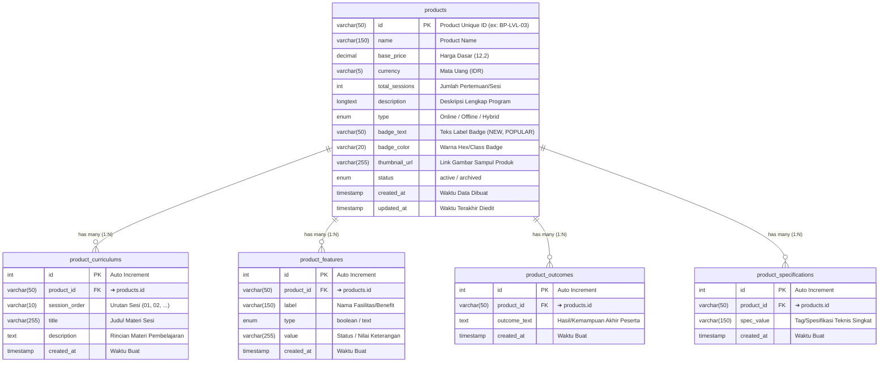
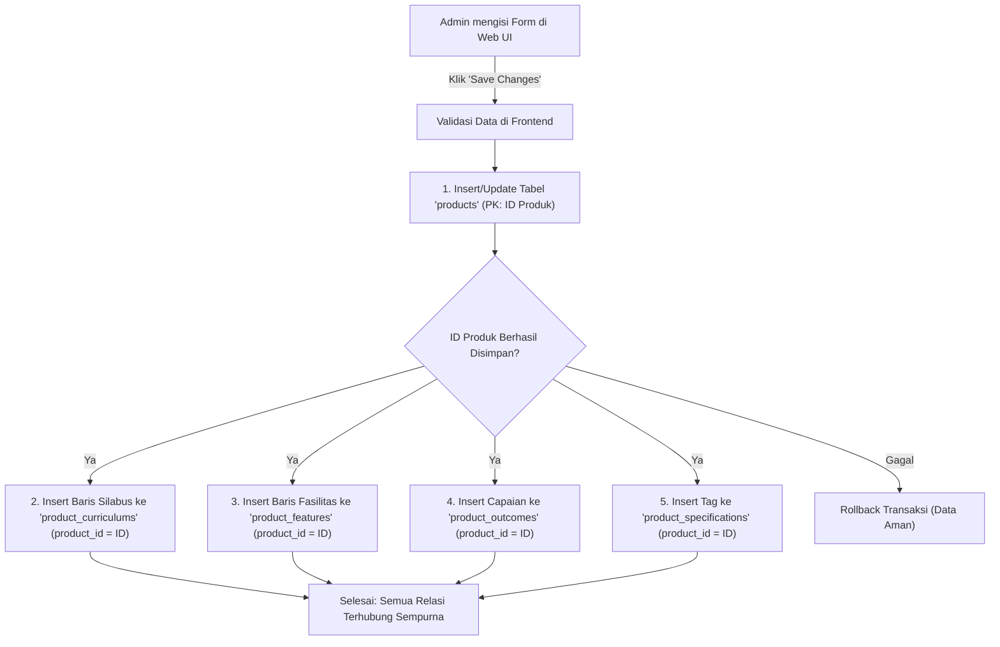

# 🗄️ Database Mapping & ERD — Product Management (Dialogika)

> [!INFO] **Ringkasan Dokumen**
> Dokumen ini merupakan pemetaan rancangan database relasional (*Data Dictionary & Entity Relationship Diagram*) untuk modul **Product Management** pada platform internal Dialogika (`pilot.dialogika.co/product-management`). 
> Modul ini memetakan 1 formulir produk katalog menjadi 5 tabel relasional ternormalisasi ($1:N$).

---

## 1. Visual Entity Relationship Diagram (ERD)

Diagram berikut menggambarkan tabel utama `products` dan 4 tabel relasi anak (*Child Tables*) yang terikat melalui `product_id`:



---

## 2. Matriks Rincian Relasi Antar Tabel (Foreign Key Integrity)

Tabel berikut merangkum seluruh garis relasi panah yang menghubungkan tabel induk `products` dengan 4 tabel anak, termasuk aturan kardinalitas dan integritas data referensial:

| Tabel Asal (Parent) | Kardinalitas | Tabel Tujuan (Child) | Kunci Relasi (FK ➔ PK) | Aksi CASCADE | Deskripsi Hubungan Bisnis |
| :--- | :---: | :--- | :--- | :---: | :--- |
| **`products (id)`** | **$1 : N$** | **`product_curriculums`** | `product_id ➔ products.id` | `ON DELETE CASCADE`<br/>`ON UPDATE CASCADE` | **Satu produk memiliki banyak sesi silabus.** Modul materi urut ($01, 02, \dots$) terikat langsung ke ID produk. |
| **`products (id)`** | **$1 : N$** | **`product_features`** | `product_id ➔ products.id` | `ON DELETE CASCADE`<br/>`ON UPDATE CASCADE` | **Satu produk memiliki banyak fasilitas & benefit.** Checklist modul, konsultasi, dan sarana belajar terikat ke ID produk. |
| **`products (id)`** | **$1 : N$** | **`product_outcomes`** | `product_id ➔ products.id` | `ON DELETE CASCADE`<br/>`ON UPDATE CASCADE` | **Satu produk memiliki banyak target capaian peserta.** Hasil konkret kemampuan berbicara yang dijanjikan program. |
| **`products (id)`** | **$1 : N$** | **`product_specifications`**| `product_id ➔ products.id` | `ON DELETE CASCADE`<br/>`ON UPDATE CASCADE` | **Satu produk memiliki banyak poin spesifikasi.** Tag ringkas seperti "Online", "Zoom", "Max 10 Peserta". |

> [!TIP] **Keterkaitan Antar Modul di Ekosistem Pilot**
> Di luar modul Product Management, tabel `products.id` juga dirujuk oleh modul lain di sistem internal Dialogika:
> 1. **Modul Class Management (`/class-management`)**: Tabel jadwal kelas (`classes`) memiliki kolom `productId` $\rightarrow$ merujuk ke `products.id`.
> 2. **Modul Certificate (`/generate-certificate`)**: Penomoran dan pencetakan sertifikat merujuk ke kurikulum dan nama produk `products.id`.
> 3. **Modul Invoice & Marketing**: Transaksi pendaftaran member mereferensikan produk katalog yang dibeli via `products.id`.

---

## 3. Kamus Data Lengkap (Data Dictionary)

### A. Tabel Induk: `products`
Menampung identitas utama produk, harga, tipe kelas, deskripsi, dan identitas visual kartu.

| Nama Kolom | Tipe Data | Constraint | Penjelasan / Fungsi | Contoh Isi Data | Relasi / Arah Panah |
| :--- | :--- | :---: | :--- | :--- | :--- |
| **`id`** | `VARCHAR(50)` | **PK** | Kode identifikasi unik per produk katalog | `"BP-LVL-03"`, `"BASIC-PLAY"` | ➔ **Dihubungkan ke semua tabel child** |
| **`name`** | `VARCHAR(150)` | NOT NULL | Nama resmi produk / program pelatihan | `"Basic Plus - Level 03"` | - |
| **`base_price`** | `DECIMAL(12,2)`| NOT NULL | Harga dasar sebelum potongan promo | `1579000.00` | - |
| **`currency`** | `VARCHAR(5)` | DEFAULT `'IDR'` | Satuan mata uang transaksi | `"IDR"` | - |
| **`total_sessions`** | `INT(11)` | NOT NULL | Total jumlah sesi pertemuan | `4`, `8`, `12` | - |
| **`description`** | `LONGTEXT` | NULL | Uraian lengkap mengenai isi dan tujuan program | `"Program intensif public speaking tingkat lanjutan..."` | - |
| **`type`** | `ENUM` | NOT NULL | Format metode kelas (`'Online'`,`'Offline'`,`'Hybrid'`) | `'Online'` | - |
| **`badge_text`** | `VARCHAR(50)` | NULL | Label penanda khusus pada katalog | `"BEST VALUE"`, `"NEW"` | - |
| **`badge_color`** | `VARCHAR(20)` | NULL | Kode warna penanda badge visual | `"#6366f1"`, `"#10b981"` | - |
| **`thumbnail_url`** | `VARCHAR(255)`| NULL | Alamat link gambar poster/cover kelas | `"https://dialogika.co/assets/img/bp-03.webp"` | - |
| **`status`** | `ENUM` | DEFAULT `'active'` | Status publikasi katalog (`'active'`, `'archived'`) | `'active'` | - |
| **`created_at`** | `TIMESTAMP` | CURRENT_TIMESTAMP | Waktu saat data produk pertama kali dibuat | `2026-10-03 10:00:00` | - |
| **`updated_at`** | `TIMESTAMP` | ON UPDATE CURRENT_TIMESTAMP | Waktu saat ada perubahan data terakhir | `2026-10-03 10:25:00` | - |

> [!NOTE] **Catatan Perilaku Kolom Timestamp**
> - **`created_at`**: Bersifat permanen sejak baris dibuat, tidak akan pernah berubah.
> - **`updated_at`**: Akan **otomatis ter-update** setiap kali ada tombol *Save Changes* atau modifikasi kolom pada produk tersebut.

---

### B. Tabel Silabus Sesi: `product_curriculums`
Menampung materi kurikulum bertingkat dari setiap sesi pertemuan.

| Nama Kolom | Tipe Data | Constraint | Penjelasan / Fungsi | Contoh Isi Data | Relasi / Arah Panah |
| :--- | :--- | :---: | :--- | :--- | :--- |
| **`id`** | `INT(11)` | **PK, AI** | ID unik record silabus | `1`, `2`, `3` | - |
| **`product_id`** | `VARCHAR(50)` | **FK** | ID produk induk pemilik kurikulum ini | `"BP-LVL-03"` | ➔ **Merujuk ke `products.id`** |
| **`session_order`** | `VARCHAR(10)` | NOT NULL | Nomor urutan pertemuan sesi | `"01"`, `"02"`, `"03"` | - |
| **`title`** | `VARCHAR(255)` | NOT NULL | Judul materi yang dipelajari pada sesi | `"Fondasi Dasar & Kepercayaan Diri"` | - |
| **`description`** | `TEXT` | NULL | Rincian bahasan materi dan praktik | `"Member belajar mengelola rasa cemas via reframing..."` | - |
| **`created_at`** | `TIMESTAMP` | CURRENT_TIMESTAMP | Waktu data silabus diinput | `2026-10-03 10:00:00` | - |

---

### C. Tabel Fasilitas & Benefit: `product_features`
Menampung daftar fasilitas, sarana, dan benefit tambahan yang didapatkan peserta.

| Nama Kolom | Tipe Data | Constraint | Penjelasan / Fungsi | Contoh Isi Data | Relasi / Arah Panah |
| :--- | :--- | :---: | :--- | :--- | :--- |
| **`id`** | `INT(11)` | **PK, AI** | ID unik record fasilitas | `1`, `2`, `3` | - |
| **`product_id`** | `VARCHAR(50)` | **FK** | ID produk induk pemilik fasilitas ini | `"BP-LVL-03"` | ➔ **Merujuk ke `products.id`** |
| **`label`** | `VARCHAR(150)` | NOT NULL | Nama item fasilitas | `"Modul & E-Book"`, `"Evaluasi Personal"` | - |
| **`type`** | `ENUM` | NOT NULL | Tipe penanda (`'boolean'`, `'text'`) | `'boolean'` atau `'text'` | - |
| **`value`** | `VARCHAR(255)` | NOT NULL | Nilai fasilitas (status ketersediaan/detail) | `"true"`, `"Setiap Sesi"`, `"Grup WA"` | - |
| **`created_at`** | `TIMESTAMP` | CURRENT_TIMESTAMP | Waktu data fasilitas diinput | `2026-10-03 10:00:00` | - |

---

### D. Tabel Target Capaian: `product_outcomes`
Menampung sasaran kemampuan konkret yang dirasakan peserta setelah menyelesaikan program.

| Nama Kolom | Tipe Data | Constraint | Penjelasan / Fungsi | Contoh Isi Data | Relasi / Arah Panah |
| :--- | :--- | :---: | :--- | :--- | :--- |
| **`id`** | `INT(11)` | **PK, AI** | ID unik record outcome | `1`, `2` | - |
| **`product_id`** | `VARCHAR(50)` | **FK** | ID produk induk pemilik capaian ini | `"BP-LVL-03"` | ➔ **Merujuk ke `products.id`** |
| **`outcome_text`** | `TEXT` | NOT NULL | Pernyataan hasil/kemampuan akhir | `"Mampu berbicara di depan umum tanpa rasa grogi"` | - |
| **`created_at`** | `TIMESTAMP` | CURRENT_TIMESTAMP | Waktu data outcome diinput | `2026-10-03 10:00:00` | - |

---

### E. Tabel Spesifikasi Singkat: `product_specifications`
Menampung label spesifikasi format teknis kelas.

| Nama Kolom | Tipe Data | Constraint | Penjelasan / Fungsi | Contoh Isi Data | Relasi / Arah Panah |
| :--- | :--- | :---: | :--- | :--- | :--- |
| **`id`** | `INT(11)` | **PK, AI** | ID unik record spesifikasi | `1`, `2` | - |
| **`product_id`** | `VARCHAR(50)` | **FK** | ID produk induk | `"BP-LVL-03"` | ➔ **Merujuk ke `products.id`** |
| **`spec_value`** | `VARCHAR(150)` | NOT NULL | Teks spesifikasi singkat | `"Interactive Zoom"`, `"Max 10 Peserta"` | - |
| **`created_at`** | `TIMESTAMP` | CURRENT_TIMESTAMP | Waktu data spesifikasi diinput | `2026-10-03 10:00:00` | - |

---

## 3. Alur Siklus Data (Data Flow Lifecycle)

### A. Alur Simpan (Form UI ➔ 5 Tabel Database)


### B. Aturan Hapus Data (Delete Policy)
> [!WARNING] **Aturan Foreign Key `ON DELETE CASCADE`**
> Jika baris produk di tabel `products` dihapus:
> - Seluruh baris silabus di `product_curriculums` yang memiliki `product_id` sama **otomatis terhapus**.
> - Seluruh baris benefit di `product_features` **otomatis terhapus**.
> - Seluruh record di `product_outcomes` dan `product_specifications` **otomatis terhapus**.
> 
> *Alternatif aman:* Gunakan fitur **Soft Delete** dengan mengubah kolom `products.status = 'archived'`.

---

## 4. Referensi Query DDL SQL (MySQL Script)

Script DDL ini dapat langsung di-import ke MySQL / MariaDB / DBeaver:

```sql
-- 1. Tabel Utama: products
CREATE TABLE IF NOT EXISTS `products` (
  `id` VARCHAR(50) NOT NULL,
  `name` VARCHAR(150) NOT NULL,
  `base_price` DECIMAL(12,2) NOT NULL DEFAULT 0.00,
  `currency` VARCHAR(5) NOT NULL DEFAULT 'IDR',
  `total_sessions` INT(11) NOT NULL DEFAULT 1,
  `description` LONGTEXT NULL,
  `type` ENUM('Online', 'Offline', 'Hybrid') NOT NULL DEFAULT 'Online',
  `badge_text` VARCHAR(50) NULL,
  `badge_color` VARCHAR(20) NULL,
  `thumbnail_url` VARCHAR(255) NULL,
  `status` ENUM('active', 'archived') NOT NULL DEFAULT 'active',
  `created_at` TIMESTAMP NOT NULL DEFAULT CURRENT_TIMESTAMP,
  `updated_at` TIMESTAMP NOT NULL DEFAULT CURRENT_TIMESTAMP ON UPDATE CURRENT_TIMESTAMP,
  PRIMARY KEY (`id`)
) ENGINE=InnoDB DEFAULT CHARSET=utf8mb4;

-- 2. Tabel Silabus: product_curriculums
CREATE TABLE IF NOT EXISTS `product_curriculums` (
  `id` INT(11) NOT NULL AUTO_INCREMENT,
  `product_id` VARCHAR(50) NOT NULL,
  `session_order` VARCHAR(10) NOT NULL,
  `title` VARCHAR(255) NOT NULL,
  `description` TEXT NULL,
  `created_at` TIMESTAMP NOT NULL DEFAULT CURRENT_TIMESTAMP,
  PRIMARY KEY (`id`),
  INDEX `idx_curriculum_product` (`product_id`),
  CONSTRAINT `fk_curriculums_product` FOREIGN KEY (`product_id`) 
    REFERENCES `products` (`id`) ON DELETE CASCADE ON UPDATE CASCADE
) ENGINE=InnoDB DEFAULT CHARSET=utf8mb4;

-- 3. Tabel Fasilitas & Benefit: product_features
CREATE TABLE IF NOT EXISTS `product_features` (
  `id` INT(11) NOT NULL AUTO_INCREMENT,
  `product_id` VARCHAR(50) NOT NULL,
  `label` VARCHAR(150) NOT NULL,
  `type` ENUM('boolean', 'text') NOT NULL DEFAULT 'boolean',
  `value` VARCHAR(255) NOT NULL,
  `created_at` TIMESTAMP NOT NULL DEFAULT CURRENT_TIMESTAMP,
  PRIMARY KEY (`id`),
  INDEX `idx_features_product` (`product_id`),
  CONSTRAINT `fk_features_product` FOREIGN KEY (`product_id`) 
    REFERENCES `products` (`id`) ON DELETE CASCADE ON UPDATE CASCADE
) ENGINE=InnoDB DEFAULT CHARSET=utf8mb4;

-- 4. Tabel Hasil Capaian: product_outcomes
CREATE TABLE IF NOT EXISTS `product_outcomes` (
  `id` INT(11) NOT NULL AUTO_INCREMENT,
  `product_id` VARCHAR(50) NOT NULL,
  `outcome_text` TEXT NOT NULL,
  `created_at` TIMESTAMP NOT NULL DEFAULT CURRENT_TIMESTAMP,
  PRIMARY KEY (`id`),
  INDEX `idx_outcomes_product` (`product_id`),
  CONSTRAINT `fk_outcomes_product` FOREIGN KEY (`product_id`) 
    REFERENCES `products` (`id`) ON DELETE CASCADE ON UPDATE CASCADE
) ENGINE=InnoDB DEFAULT CHARSET=utf8mb4;

-- 5. Tabel Spesifikasi: product_specifications
CREATE TABLE IF NOT EXISTS `product_specifications` (
  `id` INT(11) NOT NULL AUTO_INCREMENT,
  `product_id` VARCHAR(50) NOT NULL,
  `spec_value` VARCHAR(150) NOT NULL,
  `created_at` TIMESTAMP NOT NULL DEFAULT CURRENT_TIMESTAMP,
  PRIMARY KEY (`id`),
  INDEX `idx_specifications_product` (`product_id`),
  CONSTRAINT `fk_specifications_product` FOREIGN KEY (`product_id`) 
    REFERENCES `products` (`id`) ON DELETE CASCADE ON UPDATE CASCADE
) ENGINE=InnoDB DEFAULT CHARSET=utf8mb4;
```

---

## 5. Referensi Modul Terkait

Sesuai pembagian domain arsitektur Dialogika:
- **Member Data (Peserta & Pendaftaran Kelas):** Lihat [MEMBER-DATABASE-MAPPING.md](file:///d:/MAGANG/pilot/docs/MEMBER-DATABASE-MAPPING.md)
- **Mentor Management (Coach & Penjadwalan Sesi):** Lihat [MENTOR-DATABASE-MAPPING.md](file:///d:/MAGANG/pilot/docs/MENTOR-DATABASE-MAPPING.md)
