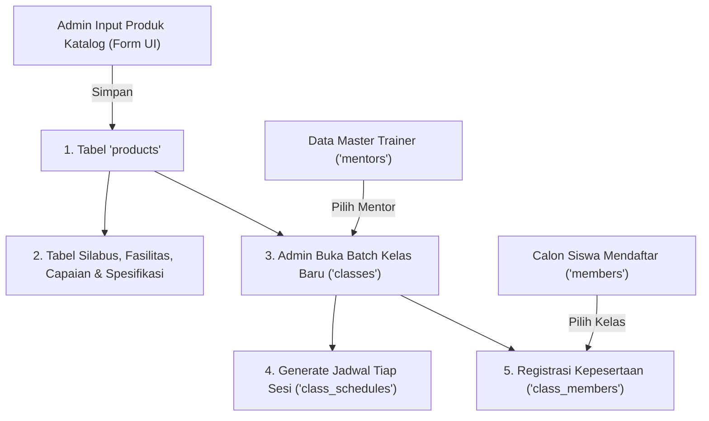

# 🗄️ Database Mapping & ERD — Product Catalog, Class, Mentor & Member (Dialogika)

> [!INFO] **Ringkasan Dokumen**
> Dokumen ini merupakan pemetaan rancangan database relasional (*Data Dictionary & Entity Relationship Diagram*) untuk modul **Product Management** dan domain operasional terkait (**Class, Mentor, Member, Enrollment, dan Scheduling**) pada platform internal Dialogika (`pilot.dialogika.co`). 
> Schema ini mengintegrasikan **10 tabel ternormalisasi** yang terbagi dalam 2 domain:
> 1. **Domain 1 (Katalog Produk)**: `products`, `product_curriculums`, `product_features`, `product_outcomes`, `product_specifications`.
> 2. **Domain 2 (Operasional Kelas & Mentor)**: `mentors`, `members`, `classes`, `class_members`, `class_schedules`.

---

## 1. Visual Entity Relationship Diagram (ERD)

Diagram berikut menggambarkan seluruh 10 entitas tabel relasional beserta foreign key dan kardinalitasnya:

```mermaid
erDiagram
    %% Domain 1: Product Catalog
    products ||--o{ product_curriculums : "has many (1:N)"
    products ||--o{ product_features : "has many (1:N)"
    products ||--o{ product_outcomes : "has many (1:N)"
    products ||--o{ product_specifications : "has many (1:N)"

    %% Inter-domain & Domain 2: Classes, Mentors, Members & Schedules
    products ||--o{ classes : "opened as (1:N)"
    mentors ||--o{ classes : "teaches (1:N)"
    classes ||--o{ class_members : "enrolls (1:N)"
    members ||--o{ class_members : "joins (1:N)"
    classes ||--o{ class_schedules : "has sessions (1:N)"

    products {
        varchar(50) id PK "Product Unique ID (ex: BP-LVL-03)"
        varchar(150) name "Product Name"
        decimal base_price "Harga Dasar (12,2)"
        varchar(5) currency "Mata Uang (IDR)"
        int total_sessions "Jumlah Pertemuan/Sesi"
        longtext description "Deskripsi Lengkap Program"
        enum type "Online / Offline / Hybrid"
        varchar(50) badge_text "Teks Label Badge (NEW, POPULAR)"
        varchar(20) badge_color "Warna Hex/Class Badge"
        varchar(255) thumbnail_url "Link Gambar Sampul Produk"
        enum status "active / archived"
        timestamp created_at "Waktu Data Dibuat"
        timestamp updated_at "Waktu Terakhir Diedit"
    }

    product_curriculums {
        int id PK "Auto Increment"
        varchar(50) product_id FK "➔ products.id"
        varchar(10) session_order "Urutan Sesi (01, 02, ...)"
        varchar(255) title "Judul Materi Sesi"
        text description "Rincian Materi Pembelajaran"
        timestamp created_at "Waktu Buat"
    }

    product_features {
        int id PK "Auto Increment"
        varchar(50) product_id FK "➔ products.id"
        varchar(150) label "Nama Fasilitas/Benefit"
        enum type "boolean / text"
        varchar(255) value "Status / Nilai Keterangan"
        timestamp created_at "Waktu Buat"
    }

    product_outcomes {
        int id PK "Auto Increment"
        varchar(50) product_id FK "➔ products.id"
        text outcome_text "Hasil/Kemampuan Akhir Peserta"
        timestamp created_at "Waktu Buat"
    }

    product_specifications {
        int id PK "Auto Increment"
        varchar(50) product_id FK "➔ products.id"
        varchar(150) spec_value "Tag/Spesifikasi Teknis Singkat"
        timestamp created_at "Waktu Buat"
    }

    mentors {
        varchar(50) id PK "Mentor Unique ID (ex: MTR-001)"
        varchar(150) full_name "Nama Lengkap & Gelar Mentor"
        varchar(20) phone_whatsapp "WhatsApp Aktif"
        varchar(100) email "Email Resmi"
        varchar(150) specialization "Spesialisasi Pengajaran"
        enum teaching_type "Online / Offline / Both"
        enum status "active / inactive"
        timestamp created_at "Waktu Didaftarkan"
    }

    members {
        varchar(50) id PK "Member Unique ID (ex: MBR-2026-0042)"
        varchar(150) full_name "Nama Lengkap Siswa"
        varchar(20) phone_whatsapp "WhatsApp Aktif"
        varchar(100) email "Email Siswa"
        varchar(100) city "Asal Kota"
        enum status "active / alumni"
        timestamp created_at "Waktu Registrasi"
    }

    classes {
        varchar(50) id PK "Class Batch ID (ex: CLS-BP03-202610)"
        varchar(50) product_id FK "➔ products.id"
        varchar(50) mentor_id FK "➔ mentors.id"
        varchar(150) name "Nama Batch Kelas"
        enum type "Online / Offline / Hybrid"
        int max_capacity "Kuota Peserta (Default 10)"
        date start_date "Tanggal Mulai Perdana"
        date end_date "Tanggal Selesai Kelulusan"
        enum status "open / ongoing / completed / cancelled"
        timestamp created_at "Waktu Dibuat"
    }

    class_members {
        int id PK "Auto Increment"
        varchar(50) class_id FK "➔ classes.id"
        varchar(50) member_id FK "➔ members.id"
        timestamp enrollment_date "Waktu Terdaftar"
        enum payment_status "paid / dp / unpaid"
        enum status "active / graduated / dropped"
    }

    class_schedules {
        int id PK "Auto Increment"
        varchar(50) class_id FK "➔ classes.id"
        varchar(10) session_order "Nomor Sesi (01, 02...)"
        varchar(255) topic_title "Topik Bahasan Sesi"
        date schedule_date "Tanggal Pertemuan"
        time start_time "Jam Mulai (19:00)"
        time end_time "Jam Selesai (21:00)"
        varchar(255) meeting_url "Link Zoom / Ruangan Offline"
        enum status "scheduled / completed / rescheduled"
        timestamp created_at "Waktu Dibuat"
    }
```



---

## 2. Matriks Rincian Relasi Antar Tabel (Foreign Key Integrity)

Tabel berikut merangkum seluruh 9 garis relasi panah yang menghubungkan tabel induk dan tabel anak, termasuk aturan kardinalitas dan integritas referensial:

| No | Tabel Asal (Parent) | Kardinalitas | Tabel Tujuan (Child) | Kunci Relasi (FK ➔ PK) | Aturan Aksi Relasi | Deskripsi Hubungan Bisnis |
| :---: | :--- | :---: | :--- | :--- | :---: | :--- |
| **1** | `products (id)` | **$1 : N$** | `product_curriculums` | `product_id ➔ products.id` | `ON DELETE CASCADE`<br/>`ON UPDATE CASCADE` | **Satu produk memiliki banyak modul silabus.** Modul materi urut ($01, 02, \dots$) terikat langsung ke ID produk katalog. |
| **2** | `products (id)` | **$1 : N$** | `product_features` | `product_id ➔ products.id` | `ON DELETE CASCADE`<br/>`ON UPDATE CASCADE` | **Satu produk memiliki banyak fasilitas & benefit.** Checklist sarana belajar terikat ke ID produk. |
| **3** | `products (id)` | **$1 : N$** | `product_outcomes` | `product_id ➔ products.id` | `ON DELETE CASCADE`<br/>`ON UPDATE CASCADE` | **Satu produk memiliki banyak capaian belajar.** Target kemampuan yang dijanjikan program. |
| **4** | `products (id)` | **$1 : N$** | `product_specifications` | `product_id ➔ products.id` | `ON DELETE CASCADE`<br/>`ON UPDATE CASCADE` | **Satu produk memiliki banyak spesifikasi.** Tag ringkas seperti "Online", "Zoom", "Max 10 Peserta". |
| **5** | `products (id)` | **$1 : N$** | `classes` | `product_id ➔ products.id` | `ON DELETE RESTRICT`<br/>`ON UPDATE CASCADE` | **1 produk katalog dibuka dalam banyak batch kelas.** Contoh: Batch Malam, Batch Pagi, Weekend. |
| **6** | `mentors (id)` | **$1 : N$** | `classes` | `mentor_id ➔ mentors.id` | `ON DELETE RESTRICT`<br/>`ON UPDATE CASCADE` | **1 mentor/coach mengampu banyak batch kelas.** Mentor terikat ke kelas sesuai ketersediaan jadwalnya. |
| **7** | `classes (id)` | **$1 : N$** | `class_members` | `class_id ➔ classes.id` | `ON DELETE CASCADE`<br/>`ON UPDATE CASCADE` | **1 batch kelas menampung hingga 10 member.** Junction table yang mencatat kepesertaan siswa. |
| **8** | `members (id)` | **$1 : N$** | `class_members` | `member_id ➔ members.id` | `ON DELETE CASCADE`<br/>`ON UPDATE CASCADE` | **1 member dapat mendaftar di lebih dari 1 kelas program.** Riwayat belajar member tersimpan rapi. |
| **9** | `classes (id)` | **$1 : N$** | `class_schedules` | `class_id ➔ classes.id` | `ON DELETE CASCADE`<br/>`ON UPDATE CASCADE` | **1 batch kelas memiliki banyak tanggal sesi.** Setiap sesi memiliki jadwal, jam, dan URL Zoom spesifik. |

---

## 3. Kamus Data Lengkap (Data Dictionary — 10 Tabel)

### A. Tabel Induk: `products`
Menampung identitas katalog produk, harga, tipe kelas, deskripsi, dan identitas visual kartu.

| Nama Kolom | Tipe Data | Constraint | Penjelasan / Fungsi | Contoh Isi Data | Relasi / Arah Panah |
| :--- | :--- | :---: | :--- | :--- | :--- |
| **`id`** | `VARCHAR(50)` | **PK** | Kode identifikasi unik per produk katalog | `"BP-LVL-03"` | ➔ **Ke 4 tabel katalog & `classes.product_id`** |
| **`name`** | `VARCHAR(150)` | NOT NULL | Nama resmi produk / program pelatihan | `"Basic Plus - Level 03"` | - |
| **`base_price`** | `DECIMAL(12,2)`| NOT NULL | Harga dasar sebelum potongan promo | `1579000.00` | - |
| **`currency`** | `VARCHAR(5)` | DEFAULT `'IDR'` | Satuan mata uang transaksi | `"IDR"` | - |
| **`total_sessions`** | `INT(11)` | NOT NULL | Total jumlah sesi pertemuan | `4` | - |
| **`description`** | `LONGTEXT` | NULL | Uraian lengkap isi dan tujuan program | `"Program intensif public speaking..."` | - |
| **`type`** | `ENUM` | NOT NULL | Format metode kelas (`'Online'`,`'Offline'`,`'Hybrid'`) | `'Online'` | - |
| **`badge_text`** | `VARCHAR(50)` | NULL | Label penanda visual katalog | `"BEST VALUE"` | - |
| **`badge_color`** | `VARCHAR(20)` | NULL | Kode warna penanda badge visual | `"#6366f1"` | - |
| **`thumbnail_url`** | `VARCHAR(255)`| NULL | Alamat link gambar poster/cover kelas | `"https://dialogika.co/assets/img/bp-03.webp"` | - |
| **`status`** | `ENUM` | DEFAULT `'active'` | Status publikasi katalog (`'active'`, `'archived'`) | `'active'` | - |
| **`created_at`** | `TIMESTAMP` | CURRENT_TIMESTAMP | Waktu pertama kali dibuat | `2026-10-03 10:00:00` | - |
| **`updated_at`** | `TIMESTAMP` | ON UPDATE CURRENT_TIMESTAMP | Waktu terakhir dimodifikasi | `2026-10-03 10:25:00` | - |

---

### B. Tabel Silabus Sesi: `product_curriculums`
Menampung materi kurikulum bertingkat dari setiap sesi pertemuan.

| Nama Kolom | Tipe Data | Constraint | Penjelasan / Fungsi | Contoh Isi Data | Relasi / Arah Panah |
| :--- | :--- | :---: | :--- | :--- | :--- |
| **`id`** | `INT(11)` | **PK, AI** | ID unik record silabus | `1`, `2`, `3` | - |
| **`product_id`** | `VARCHAR(50)` | **FK** | ID produk induk pemilik kurikulum | `"BP-LVL-03"` | ➔ **Merujuk ke `products.id`** |
| **`session_order`** | `VARCHAR(10)` | NOT NULL | Nomor urutan pertemuan sesi | `"01"`, `"02"` | - |
| **`title`** | `VARCHAR(255)` | NOT NULL | Judul materi yang dipelajari pada sesi | `"Fondasi Dasar & Kepercayaan Diri"` | - |
| **`description`** | `TEXT` | NULL | Rincian bahasan materi dan praktik | `"Member belajar mengubah gugup jadi energi..."` | - |
| **`created_at`** | `TIMESTAMP` | CURRENT_TIMESTAMP | Waktu data silabus diinput | `2026-10-03 10:00:00` | - |

---

### C. Tabel Fasilitas & Benefit: `product_features`
Menampung daftar fasilitas, sarana, dan benefit tambahan yang didapatkan peserta.

| Nama Kolom | Tipe Data | Constraint | Penjelasan / Fungsi | Contoh Isi Data | Relasi / Arah Panah |
| :--- | :--- | :---: | :--- | :--- | :--- |
| **`id`** | `INT(11)` | **PK, AI** | ID unik record fasilitas | `1`, `2` | - |
| **`product_id`** | `VARCHAR(50)` | **FK** | ID produk induk pemilik fasilitas ini | `"BP-LVL-03"` | ➔ **Merujuk ke `products.id`** |
| **`label`** | `VARCHAR(150)` | NOT NULL | Nama item fasilitas | `"Modul & E-Book"`, `"Evaluasi Personal"` | - |
| **`type`** | `ENUM` | NOT NULL | Tipe penanda (`'boolean'`, `'text'`) | `'boolean'` | - |
| **`value`** | `VARCHAR(255)` | NOT NULL | Nilai fasilitas (status ketersediaan/detail) | `"true"`, `"Setiap Sesi"` | - |
| **`created_at`** | `TIMESTAMP` | CURRENT_TIMESTAMP | Waktu data fasilitas diinput | `2026-10-03 10:00:00` | - |

---

### D. Tabel Target Capaian: `product_outcomes`
Menampung sasaran kemampuan konkret yang dirasakan peserta setelah menyelesaikan program.

| Nama Kolom         | Tipe Data     |    Constraint     | Penjelasan / Fungsi                      | Contoh Isi Data                                    | Relasi / Arah Panah            |
| :----------------- | :------------ | :---------------: | :--------------------------------------- | :------------------------------------------------- | :----------------------------- |
| **`id`**           | `INT(11)`     |    **PK, AI**     | ID unik record outcome                   | `1`, `2`                                           | -                              |
| **`product_id`**   | `VARCHAR(50)` |      **FK**       | ID produk induk pemilik capaian ini      | `"BP-LVL-03"`                                      | ➔ **Merujuk ke `products.id`** |
| **`outcome_text`** | `TEXT`        |     NOT NULL      | Pernyataan hasil/kemampuan akhir peserta | `"Mampu berbicara di depan umum tanpa rasa grogi"` | -                              |
| **`created_at`**   | `TIMESTAMP`   | CURRENT_TIMESTAMP | Waktu data outcome diinput               | `2026-10-03 10:00:00`                              | -                              |

---

### E. Tabel Spesifikasi Singkat: `product_specifications`
Menampung label spesifikasi format teknis kelas.

| Nama Kolom | Tipe Data | Constraint | Penjelasan / Fungsi | Contoh Isi Data | Relasi / Arah Panah |
| :--- | :--- | :---: | :--- | :--- | :--- |
| **`id`** | `INT(11)` | **PK, AI** | ID unik record spesifikasi | `1`, `2` | - |
| **`product_id`** | `VARCHAR(50)` | **FK** | ID produk induk | `"BP-LVL-03"` | ➔ **Merujuk ke `products.id`** |
| **`spec_value`** | `VARCHAR(150)` | NOT NULL | Teks spesifikasi singkat | `"Interactive Zoom"`, `"Max 10 Peserta"` | - |
| **`created_at`** | `TIMESTAMP` | CURRENT_TIMESTAMP | Waktu data spesifikasi diinput | `2026-10-03 10:00:00` | - |

---

### F. Tabel Master Trainer: `mentors`
Menampung profil pelatih/coach yang mengampu sesi kelas.

| Nama Kolom | Tipe Data | Constraint | Penjelasan / Fungsi | Contoh Isi Data | Relasi / Arah Panah |
| :--- | :--- | :---: | :--- | :--- | :--- |
| **`id`** | `VARCHAR(50)` | **PK** | ID unik master coach/trainer | `"MTR-001"` | ➔ **Merujuk ke `classes.mentor_id`** |
| **`full_name`** | `VARCHAR(150)` | NOT NULL | Nama lengkap dan gelar mentor | `"Coach Dimas Raditya, S.I.Kom"` | - |
| **`phone_whatsapp`** | `VARCHAR(20)` | NOT NULL | Nomor kontak WhatsApp aktif mentor | `"081234567890"` | - |
| **`email`** | `VARCHAR(100)` | NULL | Alamat email resmi mentor | `"dimas@dialogika.co"` | - |
| **`specialization`** | `VARCHAR(150)` | NOT NULL | Bidang fokus keahlian materi | `"Public Speaking Dewasa & Karir"` | - |
| **`teaching_type`** | `ENUM` | NOT NULL | Moda mengajar (`'Online'`,`'Offline'`,`'Both'`) | `'Online'` | - |
| **`status`** | `ENUM` | DEFAULT `'active'` | Status keaktifan (`'active'`,`'inactive'`) | `'active'` | - |
| **`created_at`** | `TIMESTAMP` | CURRENT_TIMESTAMP | Waktu profil mentor didaftarkan | `2026-10-03 10:00:00` | - |

---

### G. Tabel Master Peserta: `members`
Menampung data siswa/peserta pelatihan Dialogika.

| Nama Kolom | Tipe Data | Constraint | Penjelasan / Fungsi | Contoh Isi Data | Relasi / Arah Panah |
| :--- | :--- | :---: | :--- | :--- | :--- |
| **`id`** | `VARCHAR(50)` | **PK** | ID unik member peserta | `"MBR-2026-0042"` | ➔ **Merujuk ke `class_members.member_id`** |
| **`full_name`** | `VARCHAR(150)` | NOT NULL | Nama lengkap peserta | `"Fauzan Athallah"` | - |
| **`phone_whatsapp`** | `VARCHAR(20)` | NOT NULL | Nomor WhatsApp aktif siswa | `"085812345678"` | - |
| **`email`** | `VARCHAR(100)` | NULL | Email aktif siswa | `"fauzan@gmail.com"` | - |
| **`city`** | `VARCHAR(100)` | NULL | Domisili asal kota siswa | `"Jakarta Selatan"` | - |
| **`status`** | `ENUM` | DEFAULT `'active'` | Status siswa (`'active'`,`'alumni'`) | `'active'` | - |
| **`created_at`** | `TIMESTAMP` | CURRENT_TIMESTAMP | Waktu member mendaftar | `2026-10-03 10:00:00` | - |

---

### H. Tabel Master Batch Kelas: `classes`
Menampung operasional batch pembukaan program pelatihan yang diajar oleh mentor.

| Nama Kolom | Tipe Data | Constraint | Penjelasan / Fungsi | Contoh Isi Data | Relasi / Arah Panah |
| :--- | :--- | :---: | :--- | :--- | :--- |
| **`id`** | `VARCHAR(50)` | **PK** | Kode identifikasi unik per batch kelas | `"CLS-BP03-202610"` | ➔ **Ke `class_members` & `class_schedules`** |
| **`product_id`** | `VARCHAR(50)` | **FK** | ID produk katalog induk | `"BP-LVL-03"` | ➔ **Merujuk ke `products.id`** |
| **`mentor_id`** | `VARCHAR(50)` | **FK** | ID mentor pengampu batch kelas | `"MTR-001"` | ➔ **Merujuk ke `mentors.id`** |
| **`name`** | `VARCHAR(150)` | NOT NULL | Nama label batch kelas | `"Basic Plus Level 3 - Batch Oktober 2026"` | - |
| **`type`** | `ENUM` | NOT NULL | Moda kelas (`'Online'`,`'Offline'`,`'Hybrid'`) | `'Online'` | - |
| **`max_capacity`** | `INT(11)` | DEFAULT 10 | Batas maksimal kuota peserta | `10` | - |
| **`start_date`** | `DATE` | NOT NULL | Tanggal pertemuan sesi perdana | `2026-10-15` | - |
| **`end_date`** | `DATE` | NOT NULL | Tanggal sesi penutupan kelulusan | `2026-11-15` | - |
| **`status`** | `ENUM` | DEFAULT `'open'` | Status siklus (`'open'`,`'ongoing'`,`'completed'`) | `'open'` | - |
| **`created_at`** | `TIMESTAMP` | CURRENT_TIMESTAMP | Waktu batch kelas dibuat | `2026-10-03 10:00:00` | - |

---

### I. Tabel Pendaftaran Member: `class_members`
Menampung relasi banyak-ke-banyak ($M : N$) antara siswa (`members`) dan batch kelas (`classes`).

| Nama Kolom | Tipe Data | Constraint | Penjelasan / Fungsi | Contoh Isi Data | Relasi / Arah Panah |
| :--- | :--- | :---: | :--- | :--- | :--- |
| **`id`** | `INT(11)` | **PK, AI** | ID unik pendaftaran siswa | `101`, `102` | - |
| **`class_id`** | `VARCHAR(50)` | **FK** | ID batch kelas yang diikuti | `"CLS-BP03-202610"` | ➔ **Merujuk ke `classes.id`** |
| **`member_id`** | `VARCHAR(50)` | **FK** | ID member peserta yang terdaftar | `"MBR-2026-0042"` | ➔ **Merujuk ke `members.id`** |
| **`enrollment_date`** | `TIMESTAMP` | CURRENT_TIMESTAMP | Waktu resmi terdaftar di kelas | `2026-10-03 11:30:00` | - |
| **`payment_status`** | `ENUM` | NOT NULL | Status pelunasan (`'paid'`,`'dp'`,`'unpaid'`) | `'paid'` | - |
| **`status`** | `ENUM` | DEFAULT `'active'` | Status keikutsertaan (`'active'`,`'graduated'`) | `'active'` | - |

---

### J. Tabel Jadwal Sesi Kelas: `class_schedules`
Menampung tanggal dan waktu spesifik setiap sesi pertemuan dalam satu batch kelas.

| Nama Kolom | Tipe Data | Constraint | Penjelasan / Fungsi | Contoh Isi Data | Relasi / Arah Panah |
| :--- | :--- | :---: | :--- | :--- | :--- |
| **`id`** | `INT(11)` | **PK, AI** | ID unik sesi pertemuan | `1`, `2` | - |
| **`class_id`** | `VARCHAR(50)` | **FK** | ID batch kelas induk pemilik sesi | `"CLS-BP03-202610"` | ➔ **Merujuk ke `classes.id`** |
| **`session_order`** | `VARCHAR(10)` | NOT NULL | Urutan sesi pertemuan | `"01"`, `"02"` | - |
| **`topic_title`** | `VARCHAR(255)` | NOT NULL | Judul topik yang dibahas | `"Penguasaan Panggung & Vokal"` | - |
| **`schedule_date`** | `DATE` | NOT NULL | Tanggal pelaksanaan kelas | `2026-10-17` | - |
| **`start_time`** | `TIME` | NOT NULL | Jam mulai sesi | `19:00:00` | - |
| **`end_time`** | `TIME` | NOT NULL | Jam selesai sesi | `21:00:00` | - |
| **`meeting_url`** | `VARCHAR(255)`| NULL | Link Zoom / Google Meet / Ruangan Offline | `"https://zoom.us/j/dialogika-01"` | - |
| **`status`** | `ENUM` | DEFAULT `'scheduled'` | Status (`'scheduled'`,`'completed'`,`'rescheduled'`) | `'scheduled'` | - |
| **`created_at`** | `TIMESTAMP` | CURRENT_TIMESTAMP | Waktu jadwal dibuat | `2026-10-03 10:00:00` | - |

---

## 4. Alur Siklus Data (Data Flow Lifecycle)

### A. Alur Pembuatan Program Hingga Pembukaan Kelas


### B. Aturan Hapus Data (Delete Policy & Referential Integrity)
> [!WARNING] **Perbedaan Kebijakan CASCADE vs RESTRICT**
> 1. **`products ➔ Child Silabus/Fasilitas/Capaian/Spesifikasi`**: Menggunakan `ON DELETE CASCADE`. Jika produk katalog dihapus, seluruh detail silabus & fasilitasnya terhapus otomatis.
> 2. **`products ➔ classes`**: Menggunakan `ON DELETE RESTRICT`. Produk katalog **TIDAK DAPAT DIHAPUS** jika sudah pernah dibuka batch kelasnya yang memiliki histori member.
> 3. **`mentors ➔ classes`**: Menggunakan `ON DELETE RESTRICT`. Mentor yang masih aktif mengajar kelas tidak dapat dihapus sembarangan.
> 4. **`classes ➔ class_members & class_schedules`**: Menggunakan `ON DELETE CASCADE`. Menghapus draf batch kelas akan membersihkan jadwal dan pendaftaran terkait.

---

## 5. Referensi Query DDL SQL (MySQL Script Lengkap)

Script DDL siap pakai untuk MySQL / MariaDB / DBeaver:

```sql
-- =======================================================
-- DOMAIN 1: KATALOG & PAKET PRODUK
-- =======================================================

-- 1. TABEL UTAMA: products
CREATE TABLE IF NOT EXISTS `products` (
  `id` VARCHAR(50) NOT NULL,
  `name` VARCHAR(150) NOT NULL,
  `base_price` DECIMAL(12,2) NOT NULL DEFAULT 0.00,
  `currency` VARCHAR(5) NOT NULL DEFAULT 'IDR',
  `total_sessions` INT(11) NOT NULL DEFAULT 1,
  `description` LONGTEXT NULL,
  `type` ENUM('Online', 'Offline', 'Hybrid') NOT NULL DEFAULT 'Online',
  `badge_text` VARCHAR(50) NULL,
  `badge_color` VARCHAR(20) NULL,
  `thumbnail_url` VARCHAR(255) NULL,
  `status` ENUM('active', 'archived') NOT NULL DEFAULT 'active',
  `created_at` TIMESTAMP NOT NULL DEFAULT CURRENT_TIMESTAMP,
  `updated_at` TIMESTAMP NOT NULL DEFAULT CURRENT_TIMESTAMP ON UPDATE CURRENT_TIMESTAMP,
  PRIMARY KEY (`id`)
) ENGINE=InnoDB DEFAULT CHARSET=utf8mb4;

-- 2. TABEL SILABUS: product_curriculums
CREATE TABLE IF NOT EXISTS `product_curriculums` (
  `id` INT(11) NOT NULL AUTO_INCREMENT,
  `product_id` VARCHAR(50) NOT NULL,
  `session_order` VARCHAR(10) NOT NULL,
  `title` VARCHAR(255) NOT NULL,
  `description` TEXT NULL,
  `created_at` TIMESTAMP NOT NULL DEFAULT CURRENT_TIMESTAMP,
  PRIMARY KEY (`id`),
  INDEX `idx_curriculum_product` (`product_id`),
  CONSTRAINT `fk_curriculums_product` FOREIGN KEY (`product_id`) 
    REFERENCES `products` (`id`) ON DELETE CASCADE ON UPDATE CASCADE
) ENGINE=InnoDB DEFAULT CHARSET=utf8mb4;

-- 3. TABEL FASILITAS & BENEFIT: product_features
CREATE TABLE IF NOT EXISTS `product_features` (
  `id` INT(11) NOT NULL AUTO_INCREMENT,
  `product_id` VARCHAR(50) NOT NULL,
  `label` VARCHAR(150) NOT NULL,
  `type` ENUM('boolean', 'text') NOT NULL DEFAULT 'boolean',
  `value` VARCHAR(255) NOT NULL,
  `created_at` TIMESTAMP NOT NULL DEFAULT CURRENT_TIMESTAMP,
  PRIMARY KEY (`id`),
  INDEX `idx_features_product` (`product_id`),
  CONSTRAINT `fk_features_product` FOREIGN KEY (`product_id`) 
    REFERENCES `products` (`id`) ON DELETE CASCADE ON UPDATE CASCADE
) ENGINE=InnoDB DEFAULT CHARSET=utf8mb4;

-- 4. TABEL HASIL CAPAIAN: product_outcomes
CREATE TABLE IF NOT EXISTS `product_outcomes` (
  `id` INT(11) NOT NULL AUTO_INCREMENT,
  `product_id` VARCHAR(50) NOT NULL,
  `outcome_text` TEXT NOT NULL,
  `created_at` TIMESTAMP NOT NULL DEFAULT CURRENT_TIMESTAMP,
  PRIMARY KEY (`id`),
  INDEX `idx_outcomes_product` (`product_id`),
  CONSTRAINT `fk_outcomes_product` FOREIGN KEY (`product_id`) 
    REFERENCES `products` (`id`) ON DELETE CASCADE ON UPDATE CASCADE
) ENGINE=InnoDB DEFAULT CHARSET=utf8mb4;

-- 5. TABEL SPESIFIKASI: product_specifications
CREATE TABLE IF NOT EXISTS `product_specifications` (
  `id` INT(11) NOT NULL AUTO_INCREMENT,
  `product_id` VARCHAR(50) NOT NULL,
  `spec_value` VARCHAR(150) NOT NULL,
  `created_at` TIMESTAMP NOT NULL DEFAULT CURRENT_TIMESTAMP,
  PRIMARY KEY (`id`),
  INDEX `idx_specifications_product` (`product_id`),
  CONSTRAINT `fk_specifications_product` FOREIGN KEY (`product_id`) 
    REFERENCES `products` (`id`) ON DELETE CASCADE ON UPDATE CASCADE
) ENGINE=InnoDB DEFAULT CHARSET=utf8mb4;

-- =======================================================
-- DOMAIN 2: MASTER MENTOR, SISWA, KELAS & PENJADWALAN
-- =======================================================

-- 6. TABEL MASTER MENTOR: mentors
CREATE TABLE IF NOT EXISTS `mentors` (
  `id` VARCHAR(50) NOT NULL,
  `full_name` VARCHAR(150) NOT NULL,
  `phone_whatsapp` VARCHAR(20) NOT NULL,
  `email` VARCHAR(100) NULL,
  `specialization` VARCHAR(150) NOT NULL,
  `teaching_type` ENUM('Online', 'Offline', 'Both') NOT NULL DEFAULT 'Online',
  `status` ENUM('active', 'inactive') NOT NULL DEFAULT 'active',
  `created_at` TIMESTAMP NOT NULL DEFAULT CURRENT_TIMESTAMP,
  PRIMARY KEY (`id`)
) ENGINE=InnoDB DEFAULT CHARSET=utf8mb4;

-- 7. TABEL MASTER SISWA: members
CREATE TABLE IF NOT EXISTS `members` (
  `id` VARCHAR(50) NOT NULL,
  `full_name` VARCHAR(150) NOT NULL,
  `phone_whatsapp` VARCHAR(20) NOT NULL,
  `email` VARCHAR(100) NULL,
  `city` VARCHAR(100) NULL,
  `status` ENUM('active', 'alumni') NOT NULL DEFAULT 'active',
  `created_at` TIMESTAMP NOT NULL DEFAULT CURRENT_TIMESTAMP,
  PRIMARY KEY (`id`)
) ENGINE=InnoDB DEFAULT CHARSET=utf8mb4;

-- 8. TABEL MASTER BATCH KELAS: classes
CREATE TABLE IF NOT EXISTS `classes` (
  `id` VARCHAR(50) NOT NULL,
  `product_id` VARCHAR(50) NOT NULL,
  `mentor_id` VARCHAR(50) NOT NULL,
  `name` VARCHAR(150) NOT NULL,
  `type` ENUM('Online', 'Offline', 'Hybrid') NOT NULL DEFAULT 'Online',
  `max_capacity` INT(11) NOT NULL DEFAULT 10,
  `start_date` DATE NOT NULL,
  `end_date` DATE NOT NULL,
  `status` ENUM('open', 'ongoing', 'completed', 'cancelled') NOT NULL DEFAULT 'open',
  `created_at` TIMESTAMP NOT NULL DEFAULT CURRENT_TIMESTAMP,
  PRIMARY KEY (`id`),
  INDEX `idx_classes_product` (`product_id`),
  INDEX `idx_classes_mentor` (`mentor_id`),
  CONSTRAINT `fk_classes_product` FOREIGN KEY (`product_id`)
    REFERENCES `products` (`id`) ON DELETE RESTRICT ON UPDATE CASCADE,
  CONSTRAINT `fk_classes_mentor` FOREIGN KEY (`mentor_id`)
    REFERENCES `mentors` (`id`) ON DELETE RESTRICT ON UPDATE CASCADE
) ENGINE=InnoDB DEFAULT CHARSET=utf8mb4;

-- 9. TABEL PENDAFTARAN KELAS (JUNCTION M:N): class_members
CREATE TABLE IF NOT EXISTS `class_members` (
  `id` INT(11) NOT NULL AUTO_INCREMENT,
  `class_id` VARCHAR(50) NOT NULL,
  `member_id` VARCHAR(50) NOT NULL,
  `enrollment_date` TIMESTAMP NOT NULL DEFAULT CURRENT_TIMESTAMP,
  `payment_status` ENUM('paid', 'dp', 'unpaid') NOT NULL DEFAULT 'paid',
  `status` ENUM('active', 'graduated', 'dropped') NOT NULL DEFAULT 'active',
  PRIMARY KEY (`id`),
  UNIQUE KEY `uq_class_member` (`class_id`, `member_id`),
  INDEX `idx_class_members_class` (`class_id`),
  INDEX `idx_class_members_member` (`member_id`),
  CONSTRAINT `fk_class_members_class` FOREIGN KEY (`class_id`)
    REFERENCES `classes` (`id`) ON DELETE CASCADE ON UPDATE CASCADE,
  CONSTRAINT `fk_class_members_member` FOREIGN KEY (`member_id`)
    REFERENCES `members` (`id`) ON DELETE CASCADE ON UPDATE CASCADE
) ENGINE=InnoDB DEFAULT CHARSET=utf8mb4;

-- 10. TABEL PENJADWALAN SESI KELAS: class_schedules
CREATE TABLE IF NOT EXISTS `class_schedules` (
  `id` INT(11) NOT NULL AUTO_INCREMENT,
  `class_id` VARCHAR(50) NOT NULL,
  `session_order` VARCHAR(10) NOT NULL,
  `topic_title` VARCHAR(255) NOT NULL,
  `schedule_date` DATE NOT NULL,
  `start_time` TIME NOT NULL,
  `end_time` TIME NOT NULL,
  `meeting_url` VARCHAR(255) NULL,
  `status` ENUM('scheduled', 'completed', 'rescheduled') NOT NULL DEFAULT 'scheduled',
  `created_at` TIMESTAMP NOT NULL DEFAULT CURRENT_TIMESTAMP,
  PRIMARY KEY (`id`),
  INDEX `idx_schedules_class` (`class_id`),
  CONSTRAINT `fk_schedules_class` FOREIGN KEY (`class_id`)
    REFERENCES `classes` (`id`) ON DELETE CASCADE ON UPDATE CASCADE
) ENGINE=InnoDB DEFAULT CHARSET=utf8mb4;
```
