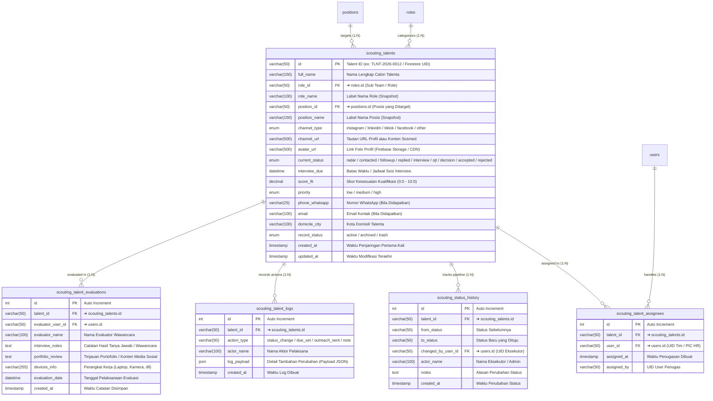
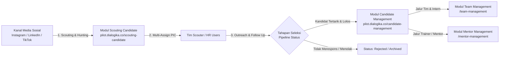

# 🔭 Database Mapping & ERD — Scouting Candidate (Dialogika)

> [!INFO] **Ringkasan Dokumen**
> Dokumen ini merupakan pemetaan rancangan database relasional (*Data Dictionary & Entity Relationship Diagram*) untuk modul **Scouting Candidate** pada sistem internal Dialogika (`pilot.dialogika.co/scouting-candidate`).
> Modul ini memetakan seluruh alur penjaringan calon talenta potensial (*talent hunting*) dari kanal media sosial (Instagram, LinkedIn, TikTok, Facebook), penugasan tim (*assigned PIC*), riwayat tahapan kontak (*recruitment status pipeline*), jadwal wawancara, hingga catatan evaluasi ke dalam **5 tabel relasional ternormalisasi (3NF)** dengan relasi yang kokoh terhadap master `roles`, `positions`, dan `users`.

---

## 1. Visual Entity Relationship Diagram (ERD)

Diagram berikut menggambarkan entitas utama `scouting_talents` beserta tabel anak (*Child Tables*) dan relasinya terhadap tabel master ekosistem Dialogika:



---

## 2. Matriks Rincian Relasi Antar Tabel (Foreign Key Integrity)

Tabel berikut merangkum integritas referensial dan aturan kardinalitas antara tabel induk `scouting_talents` dengan tabel relasi anak (*Child Tables*) serta master data terkait:

| Tabel Asal (Parent) | Kardinalitas | Tabel Tujuan (Child) | Kunci Relasi (FK ➔ PK) | Aksi CASCADE | Deskripsi Hubungan Bisnis |
| :--- | :---: | :--- | :--- | :---: | :--- |
| **`roles (id)`** | **$1 : N$** | **`scouting_talents`** | `role_id ➔ roles.id` | `ON DELETE SET NULL`<br/>`ON UPDATE CASCADE` | **Satu role/sub team mengelompokkan banyak talenta scouting.** Jika role dihapus, relasi diset NULL tanpa menghapus data talenta. |
| **`positions (id)`** | **$1 : N$** | **`scouting_talents`** | `position_id ➔ positions.id` | `ON DELETE SET NULL`<br/>`ON UPDATE CASCADE` | **Satu formasi/posisi ditargetkan untuk banyak calon talenta.** Menghubungkan kebutuhan divisi dengan target hunting. |
| **`scouting_talents (id)`** | **$1 : N$** | **`scouting_talent_assignees`** | `talent_id ➔ scouting_talents.id` | `ON DELETE CASCADE`<br/>`ON UPDATE CASCADE` | **Satu talenta dapat ditugaskan ke beberapa personil (*multi-assign*).** Menampilkan *avatar stack* tim PIC penanggung jawab outreach. |
| **`users (id)`** | **$1 : N$** | **`scouting_talent_assignees`** | `user_id ➔ users.id` | `ON DELETE CASCADE`<br/>`ON UPDATE CASCADE` | **Satu anggota tim (user) dapat menangani banyak talenta sekaligus.** |
| **`scouting_talents (id)`** | **$1 : N$** | **`scouting_status_history`** | `talent_id ➔ scouting_talents.id` | `ON DELETE CASCADE`<br/>`ON UPDATE CASCADE` | **Satu talenta memiliki linimasa perpindahan status.** Melacak transisi dari *Radar* $\rightarrow$ *Contacted* $\rightarrow$ *Follow Up* $\rightarrow$ *Respond* $\rightarrow$ *Interview* $\rightarrow$ *Accepted/Rejected*. |
| **`scouting_talents (id)`** | **$1 : N$** | **`scouting_talent_logs`** | `talent_id ➔ scouting_talents.id` | `ON DELETE CASCADE`<br/>`ON UPDATE CASCADE` | **Satu talenta memiliki riwayat audit jejak aktivitas (*activity log*).** Mencatat pengubahan due date, pesan outreach, dll. |
| **`scouting_talents (id)`** | **$1 : N$** | **`scouting_talent_evaluations`** | `talent_id ➔ scouting_talents.id` | `ON DELETE CASCADE`<br/>`ON UPDATE CASCADE` | **Satu talenta dapat memiliki ulasan penilaian wawancara awal dan portofolio.** |

---

## 3. Kamus Data Lengkap (Data Dictionary)

### A. Tabel Induk: `scouting_talents`
Menampung identitas profil talenta scouting, link kanal media sosial, posisi incaran, status tahapan pipeline, serta ringkasan preferensi kerja.

| Nama Kolom | Tipe Data | Constraint | Penjelasan / Fungsi | Contoh Isi Data | Relasi / Keterangan |
| :--- | :--- | :---: | :--- | :--- | :--- |
| **`id`** | `VARCHAR(50)` | **PK** | Kode unik identifikasi talenta scouting | `"TLNT-2026-0012"`, `"7mF89KxL29"` | ➔ **Dihubungkan ke semua tabel child** |
| **`full_name`** | `VARCHAR(150)` | NOT NULL | Nama lengkap atau nama display akun talenta | `"Jasmin Azzahra"`, `"Zahra Khairunnisa"` | - |
| **`role_id`** | `VARCHAR(50)` | FK, NULL | ID referensi role / sub team target | `"ROL-SUBTEAM-01"` | ➔ Merujuk ke master `roles.id` |
| **`role_name`** | `VARCHAR(100)` | NULL | Label nama peran (*caching/snapshot*) | `"Sub Team"`, `"Core Team"` | Mempercepat render kartu UI |
| **`position_id`** | `VARCHAR(50)` | FK, NULL | ID referensi master formasi posisi | `"POS-BRANDING-02"` | ➔ Merujuk ke master `positions.id` |
| **`position_name`** | `VARCHAR(150)` | NULL | Label formasi kerja (*caching/snapshot*) | `"Branding Team"`, `"Talent Speaker"` | Mempercepat render kartu UI |
| **`channel_type`** | `ENUM` | NOT NULL, DEFAULT `'instagram'` | Jenis platform media sosial sumber hunting (`'instagram'`, `'linkedin'`, `'tiktok'`, `'facebook'`, `'other'`) | `'instagram'` | Menentukan ikon platform di kartu UI |
| **`channel_url`** | `VARCHAR(500)` | NULL | Tautan langsung menuju postingan atau akun profil | `"https://instagram.com/jasmin_az"` | Ditautkan pada tombol badge platform |
| **`avatar_url`** | `VARCHAR(500)` | NULL | Tautan gambar foto profil (Firebase Storage / CDN) | `"https://storage.googleapis.com/.../photo.webp"` | Ditampilkan sebagai gambar utama kartu |
| **`current_status`** | `ENUM` | NOT NULL, DEFAULT `'radar'` | Status seleksi aktif (`'radar'`, `'contacted'`, `'followup'`, `'replied'`, `'interview'`, `'ojt'`, `'decision'`, `'accepted'`, `'rejected'`) | `'radar'`, `'contacted'` | Dipakai untuk filter & dropdown status |
| **`interview_due`** | `DATETIME` | NULL | Batas waktu tindak lanjut atau jadwal sesi wawancara | `2026-10-10 14:00:00` | Diinput via `datetime-local` di tabel baris |
| **`score_fit`** | `DECIMAL(3,1)` | NULL | Penilaian tingkat kecocokan profil kandidat ($0.0 - 10.0$) | `8.5`, `9.0` | Indikator evaluasi talenta potensial |
| **`priority`** | `ENUM` | NOT NULL, DEFAULT `'medium'` | Skala prioritas follow up (`'low'`, `'medium'`, `'high'`) | `'high'` | Membantu filter kandidat unggulan |
| **`phone_whatsapp`** | `VARCHAR(25)` | NULL | Nomor kontak WhatsApp aktif talenta | `"+6281234567890"` | Diikutsertakan saat ekspor Excel/CSV |
| **`email`** | `VARCHAR(100)` | NULL | Alamat email resmi bila sudah diperoleh | `"jasmin.azzahra@gmail.com"` | Diikutsertakan saat ekspor Excel/CSV |
| **`domicile_city`** | `VARCHAR(100)` | NULL | Kota domisili calon talenta | `"Yogyakarta"`, `"Jakarta Selatan"` | Diikutsertakan saat ekspor Excel/CSV |
| **`record_status`** | `ENUM` | NOT NULL, DEFAULT `'active'` | Status keberadaan record (`'active'`, `'archived'`, `'trash'`) | `'active'` | Soft delete penanganan data |
| **`created_at`** | `TIMESTAMP` | CURRENT_TIMESTAMP | Waktu pertama kali talenta didata ke dalam sistem | `2026-10-04 14:20:00` | Acuan sorting "Terkini" & "Terlama" |
| **`updated_at`** | `TIMESTAMP` | ON UPDATE CURRENT_TIMESTAMP | Waktu terakhir perubahan informasi talenta | `2026-10-04 14:50:00` | - |

---

### B. Tabel Penugasan Tim: `scouting_talent_assignees`
Menampung penugasan anggota tim internal Dialogika (*PIC HR / Scouter*) yang bertanggung jawab melakukan pendekatan dan komunikasi dengan talenta.

| Nama Kolom | Tipe Data | Constraint | Penjelasan / Fungsi | Contoh Isi Data | Relasi / Keterangan |
| :--- | :--- | :---: | :--- | :--- | :--- |
| **`id`** | `INT(11)` | **PK, AI** | ID unik penugasan personil | `1`, `2`, `3` | - |
| **`talent_id`** | `VARCHAR(50)` | **FK** | ID talenta yang ditugaskan | `"TLNT-2026-0012"` | ➔ **Merujuk ke `scouting_talents.id`** |
| **`user_id`** | `VARCHAR(50)` | **FK** | UID user anggota tim penanggung jawab | `"USR-AFRA-01"` | ➔ Merujuk ke master `users.id` |
| **`assigned_at`** | `TIMESTAMP` | CURRENT_TIMESTAMP | Waktu penugasan dilakukan | `2026-10-04 14:25:00` | - |
| **`assigned_by`** | `VARCHAR(50)` | NULL | UID user pembuat penugasan | `"USR-ADMIN-01"` | ➔ Merujuk ke master `users.id` |

---

### C. Tabel Riwayat Status: `scouting_status_history`
Menampung log audit jejak perpindahan status (*state transition history*) talenta dari awal masuk *Radar* hingga keputusan final.

| Nama Kolom | Tipe Data | Constraint | Penjelasan / Fungsi | Contoh Isi Data | Relasi / Keterangan |
| :--- | :--- | :---: | :--- | :--- | :--- |
| **`id`** | `INT(11)` | **PK, AI** | ID unik baris log status | `1`, `2`, `3` | - |
| **`talent_id`** | `VARCHAR(50)` | **FK** | ID talenta yang statusnya berubah | `"TLNT-2026-0012"` | ➔ **Merujuk ke `scouting_talents.id`** |
| **`from_status`** | `VARCHAR(50)` | NULL | Tahapan status sebelum perubahan | `"radar"` | - |
| **`to_status`** | `VARCHAR(50)` | NOT NULL | Tahapan status baru | `"contacted"`, `"replied"` | - |
| **`changed_by_user_id`** | `VARCHAR(50)` | NULL | UID personil pengeksekusi status | `"USR-AFRA-01"` | ➔ Merujuk ke master `users.id` |
| **`actor_name`** | `VARCHAR(100)` | NULL | Nama display personil pengeksekusi | `"Afra Habibi"` | - |
| **`notes`** | `TEXT` | NULL | Catatan pertimbangan transisi / pesan DM yang dikirimkan | `"DM Instagram terkirim, menunggu respons."` | - |
| **`created_at`** | `TIMESTAMP` | CURRENT_TIMESTAMP | Waktu status resmi diubah | `2026-10-04 14:30:00` | Memetakan `recruitment_status.history` |

---

### D. Tabel Log Aktivitas: `scouting_talent_logs`
Menampung histori tindakan terperinci, seperti penyetelan jadwal wawancara (*due_set*), perubahan form, pengiriman reminder, atau pencatatan interaksi.

| Nama Kolom | Tipe Data | Constraint | Penjelasan / Fungsi | Contoh Isi Data | Relasi / Keterangan |
| :--- | :--- | :---: | :--- | :--- | :--- |
| **`id`** | `INT(11)` | **PK, AI** | ID unik entri log aktivitas | `1`, `2` | - |
| **`talent_id`** | `VARCHAR(50)` | **FK** | ID talenta yang bersangkutan | `"TLNT-2026-0012"` | ➔ **Merujuk ke `scouting_talents.id`** |
| **`action_type`** | `VARCHAR(50)` | NOT NULL | Jenis aksi (`'status_change'`, `'due_set'`, `'dm_outreach'`, `'note'`) | `'due_set'` | - |
| **`actor_name`** | `VARCHAR(100)` | NULL | Nama user pelaksana aksi | `"Afra Habibi"` | - |
| **`log_payload`** | `JSON` | NULL | Parameter detail data log | `{"due": "2026-10-10T14:00"}` | Fleksibel untuk audit trail |
| **`created_at`** | `TIMESTAMP` | CURRENT_TIMESTAMP | Waktu pencatatan log | `2026-10-04 14:35:00` | - |

---

### E. Tabel Ulasan & Evaluasi: `scouting_talent_evaluations`
Menampung ulasan hasil wawancara pendahuluan, penilaian portofolio karya, kelayakan perangkat, dan catatan kecocokan budaya kerja.

| Nama Kolom | Tipe Data | Constraint | Penjelasan / Fungsi | Contoh Isi Data | Relasi / Keterangan |
| :--- | :--- | :---: | :--- | :--- | :--- |
| **`id`** | `INT(11)` | **PK, AI** | ID unik sesi evaluasi | `1`, `2` | - |
| **`talent_id`** | `VARCHAR(50)` | **FK** | ID talenta yang dinilai | `"TLNT-2026-0012"` | ➔ **Merujuk ke `scouting_talents.id`** |
| **`evaluator_user_id`** | `VARCHAR(50)` | NULL | UID interviewer penilai | `"USR-DWI-02"` | ➔ Merujuk ke master `users.id` |
| **`evaluator_name`** | `VARCHAR(100)` | NULL | Nama lengkap penilai | `"Dwi Prasetio, M.Psi"` | - |
| **`interview_notes`** | `TEXT` | NULL | Catatan interview pendahuluan | `"Kandidat bersedia komitmen WFO 3 hari, antusias tinggi."` | - |
| **`portfolio_review`** | `TEXT` | NULL | Ulasan feed / portofolio karya sosmed | `"Gaya visual postingan cocok dengan persona Dialogika."` | - |
| **`devices_info`** | `VARCHAR(255)` | NULL | Informasi kelayakan perangkat kerja | `"MacBook M2, Ringlight, Mikrofon Rode"` | - |
| **`evaluation_date`** | `DATETIME` | NULL | Tanggal pelaksanaan evaluasi | `2026-10-10 14:30:00` | - |
| **`created_at`** | `TIMESTAMP` | CURRENT_TIMESTAMP | Waktu data evaluasi diinput | `2026-10-10 15:00:00` | - |

---

## 4. MySQL DDL Script (Production Ready)

Skrip SQL berikut siap dieksekusi pada database engine **MySQL 8.0+ / MariaDB 10.5+ (InnoDB)** lengkap dengan konfigurasi *Foreign Key Integrity*, *Cascading*, serta pengindeksan performa (*composite indexes*):

```sql
-- =====================================================================
-- DIALOGIKA SCOUTING CANDIDATE RELATIONAL SCHEMA (MySQL 8.0 / InnoDB)
-- =====================================================================

-- 1. TABEL UTAMA: scouting_talents
CREATE TABLE IF NOT EXISTS `scouting_talents` (
  `id` VARCHAR(50) NOT NULL,
  `full_name` VARCHAR(150) NOT NULL,
  `role_id` VARCHAR(50) NULL,
  `role_name` VARCHAR(100) NULL,
  `position_id` VARCHAR(50) NULL,
  `position_name` VARCHAR(150) NULL,
  `channel_type` ENUM('instagram', 'linkedin', 'tiktok', 'facebook', 'other') NOT NULL DEFAULT 'instagram',
  `channel_url` VARCHAR(500) NULL,
  `avatar_url` VARCHAR(500) NULL,
  `current_status` ENUM('radar', 'contacted', 'followup', 'replied', 'interview', 'ojt', 'decision', 'accepted', 'rejected') NOT NULL DEFAULT 'radar',
  `interview_due` DATETIME NULL,
  `score_fit` DECIMAL(3,1) NULL,
  `priority` ENUM('low', 'medium', 'high') NOT NULL DEFAULT 'medium',
  `phone_whatsapp` VARCHAR(25) NULL,
  `email` VARCHAR(100) NULL,
  `domicile_city` VARCHAR(100) NULL,
  `record_status` ENUM('active', 'archived', 'trash') NOT NULL DEFAULT 'active',
  `created_at` TIMESTAMP NOT NULL DEFAULT CURRENT_TIMESTAMP,
  `updated_at` TIMESTAMP NOT NULL DEFAULT CURRENT_TIMESTAMP ON UPDATE CURRENT_TIMESTAMP,
  PRIMARY KEY (`id`),
  INDEX `idx_scouting_status` (`current_status`, `record_status`),
  INDEX `idx_scouting_role_pos` (`role_id`, `position_id`),
  INDEX `idx_scouting_created` (`created_at`),
  INDEX `idx_scouting_due` (`interview_due`)
) ENGINE=InnoDB DEFAULT CHARSET=utf8mb4 COLLATE=utf8mb4_unicode_ci;

-- 2. TABEL PENUGASAN PERSONIL: scouting_talent_assignees
CREATE TABLE IF NOT EXISTS `scouting_talent_assignees` (
  `id` INT(11) NOT NULL AUTO_INCREMENT,
  `talent_id` VARCHAR(50) NOT NULL,
  `user_id` VARCHAR(50) NOT NULL,
  `assigned_at` TIMESTAMP NOT NULL DEFAULT CURRENT_TIMESTAMP,
  `assigned_by` VARCHAR(50) NULL,
  PRIMARY KEY (`id`),
  UNIQUE KEY `uq_talent_user` (`talent_id`, `user_id`),
  INDEX `idx_assignees_talent` (`talent_id`),
  INDEX `idx_assignees_user` (`user_id`),
  CONSTRAINT `fk_scout_assignees_talent` FOREIGN KEY (`talent_id`)
    REFERENCES `scouting_talents` (`id`) ON DELETE CASCADE ON UPDATE CASCADE
) ENGINE=InnoDB DEFAULT CHARSET=utf8mb4 COLLATE=utf8mb4_unicode_ci;

-- 3. TABEL LOG PERUBAHAN STATUS: scouting_status_history
CREATE TABLE IF NOT EXISTS `scouting_status_history` (
  `id` INT(11) NOT NULL AUTO_INCREMENT,
  `talent_id` VARCHAR(50) NOT NULL,
  `from_status` VARCHAR(50) NULL,
  `to_status` VARCHAR(50) NOT NULL,
  `changed_by_user_id` VARCHAR(50) NULL,
  `actor_name` VARCHAR(100) NULL,
  `notes` TEXT NULL,
  `created_at` TIMESTAMP NOT NULL DEFAULT CURRENT_TIMESTAMP,
  PRIMARY KEY (`id`),
  INDEX `idx_scout_history_talent` (`talent_id`),
  INDEX `idx_scout_history_created` (`created_at`),
  CONSTRAINT `fk_scout_history_talent` FOREIGN KEY (`talent_id`)
    REFERENCES `scouting_talents` (`id`) ON DELETE CASCADE ON UPDATE CASCADE
) ENGINE=InnoDB DEFAULT CHARSET=utf8mb4 COLLATE=utf8mb4_unicode_ci;

-- 4. TABEL AUDIT JEJAK AKTIVITAS: scouting_talent_logs
CREATE TABLE IF NOT EXISTS `scouting_talent_logs` (
  `id` INT(11) NOT NULL AUTO_INCREMENT,
  `talent_id` VARCHAR(50) NOT NULL,
  `action_type` VARCHAR(50) NOT NULL,
  `actor_name` VARCHAR(100) NULL,
  `log_payload` JSON NULL,
  `created_at` TIMESTAMP NOT NULL DEFAULT CURRENT_TIMESTAMP,
  PRIMARY KEY (`id`),
  INDEX `idx_scout_logs_talent` (`talent_id`),
  INDEX `idx_scout_logs_action` (`action_type`),
  CONSTRAINT `fk_scout_logs_talent` FOREIGN KEY (`talent_id`)
    REFERENCES `scouting_talents` (`id`) ON DELETE CASCADE ON UPDATE CASCADE
) ENGINE=InnoDB DEFAULT CHARSET=utf8mb4 COLLATE=utf8mb4_unicode_ci;

-- 5. TABEL EVALUASI & WAWANCARA: scouting_talent_evaluations
CREATE TABLE IF NOT EXISTS `scouting_talent_evaluations` (
  `id` INT(11) NOT NULL AUTO_INCREMENT,
  `talent_id` VARCHAR(50) NOT NULL,
  `evaluator_user_id` VARCHAR(50) NULL,
  `evaluator_name` VARCHAR(100) NULL,
  `interview_notes` TEXT NULL,
  `portfolio_review` TEXT NULL,
  `devices_info` VARCHAR(255) NULL,
  `evaluation_date` DATETIME NULL,
  `created_at` TIMESTAMP NOT NULL DEFAULT CURRENT_TIMESTAMP,
  PRIMARY KEY (`id`),
  INDEX `idx_scout_eval_talent` (`talent_id`),
  CONSTRAINT `fk_scout_eval_talent` FOREIGN KEY (`talent_id`)
    REFERENCES `scouting_talents` (`id`) ON DELETE CASCADE ON UPDATE CASCADE
) ENGINE=InnoDB DEFAULT CHARSET=utf8mb4 COLLATE=utf8mb4_unicode_ci;
```

---

## 5. Pemetaan Dokumen NoSQL Firestore ke Skema Relasional

Sistem *Pilot Dialogika* saat ini beroperasi menggunakan Google Cloud Firestore (`talents` collection). Berikut adalah panduan pemetaan (*mapping reference*) dari struktur dokumen NoSQL eksisting ke skema tabel relasional SQL yang dirancang:

| Path Field Dokumen Firestore (`talents/{docId}`) | Tipe Asal NoSQL | Tabel SQL Tujuan | Kolom SQL Tujuan | Catatan Transformasi |
| :--- | :--- | :--- | :--- | :--- |
| `doc.id` | `string` | `scouting_talents` | `id` | Kunci primer identik dokumen. |
| `basic_info.full_name` | `string` | `scouting_talents` | `full_name` | Nama kandidat utama. |
| `basic_info.avatar_url` | `string` | `scouting_talents` | `avatar_url` | URL Storage gambar foto kandidat. |
| `basic_info.current_role` | `string` | `scouting_talents` | `role_name` | Denormalisasi nama role. |
| `scouting_info.role_id` | `string` | `scouting_talents` | `role_id` | Menjadi Foreign Key ke `roles.id`. |
| `scouting_info.position_id` | `string` | `scouting_talents` | `position_id` | Menjadi Foreign Key ke `positions.id`. |
| `scouting_info.position_name` | `string` | `scouting_talents` | `position_name` | Denormalisasi nama posisi. |
| `scouting_info.channel_type` | `string` | `scouting_talents` | `channel_type` | Validasi ENUM (instagram, linkedin, dll). |
| `scouting_info.channel_url` | `string` | `scouting_talents` | `channel_url` | URL channel/postingan. |
| `scouting_info.interview_due` | `ISO 8601 string` | `scouting_talents` | `interview_due` | Dikonversi menjadi `DATETIME`. |
| `scouting_info.assigned_to` | `Array<string>` | `scouting_talent_assignees` | `talent_id`, `user_id` | **Dinormalisasi**: Array UID pengguna diurai (*unwound*) menjadi baris-baris relasional. |
| `recruitment_status.current` | `string` | `scouting_talents` | `current_status` | Status tahapan seleksi aktif. |
| `recruitment_status.history` | `Array<{status, date}>` | `scouting_status_history` | `talent_id`, `to_status`, `created_at` | **Dinormalisasi**: Riwayat status diurai menjadi tabel log relasional terpisah. |
| `logs` | `Array<{action, to, by, date}>`| `scouting_talent_logs` | `talent_id`, `action_type`, `actor_name` | **Dinormalisasi**: Log aktivitas diurai ke tabel log terstruktur. |
| `interview_notes` / `profiling` | `Object / Text` | `scouting_talent_evaluations` | `interview_notes`, `portfolio_review` | Catatan ulasan kualifikasi pelamar. |
| `contact_info.whatsapp` | `string` | `scouting_talents` | `phone_whatsapp` | Nomor telepon/WA. |
| `contact_info.email` | `string` | `scouting_talents` | `email` | Alamat surel kontak. |
| `created_at` | `serverTimestamp` | `scouting_talents` | `created_at` | Waktu registrasi awal dokumen. |

---

## 6. Alur Bisnis & Integrasi Downstream



1. **Tahap Penjaringan (*Talent Hunting*)**: Tim HR atau Scouter menemukan profil berbakat di media sosial dan mencatatnya ke modul Scouting Candidate dengan status awal `Radar`.
2. **Penugasan Personil (*PIC Assignment*)**: Satu atau lebih personil ditugaskan menangani kandidat tersebut melalui fitur *Assign To* (menghasilkan *avatar stack* di kartu kandidat).
3. **Pendekatan & Komunikasi (*Outreach*)**: Personil mengirimkan pesan (DM/InMail/WA), memperbarui status menjadi `Contacted`, lalu `Follow Up`, hingga kandidat merespons (`Respond`).
4. **Wawancara Awal & OJT (*Screening*)**: Jika bersedia, jadwal wawancara ditentukan (`interview_due`), status dinaikkan menjadi `Interview` atau `On Job Test`.
5. **Eskalasi ke Candidate Management (*Handoff*)**:
   - Kandidat yang dinyatakan `Accepted` atau siap menjalani seleksi resmi langsung ditransfer ke basis data modul **Candidate Management** (`candidates` table) untuk penandatanganan berkas CV, tes psikologi, dan micro-teaching.
   - Kandidat yang menolak atau tidak memenuhi standar ditandai sebagai `Rejected` untuk arsip masa mendatang tanpa menghapus riwayat komunikasi.
