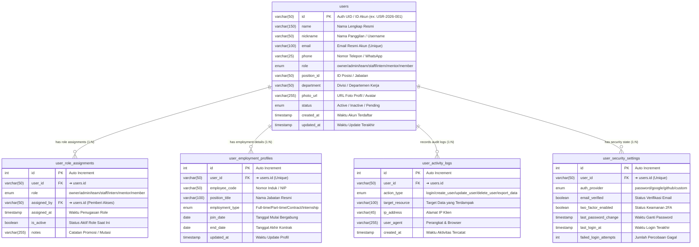

# 👥 Database Mapping & ERD — Users Management (Dialogika)

> [!INFO] **Ringkasan Dokumen**
> Dokumen ini memetakan rancangan database relasional (*Data Dictionary & Entity Relationship Diagram*) untuk modul **Users Management** pada platform internal Dialogika (`pilot.dialogika.co/users-management`).
> Modul ini mencakup direktori akun pengguna, riwayat otorisasi role (*Custom Claims & Access Control*), profil kepegawaian & jabatan, jejak audit aktivitas (*Audit Trail Log*), serta status keamanan akun pengguna ke dalam **5 tabel relasional ternormalisasi (3NF)** dengan relasi One-to-Many ($1:N$) berintegritas referensial `CASCADE`.

---

## 1. Visual Entity Relationship Diagram (ERD)

Diagram berikut merepresentasikan tabel induk `users` (direktori akun terdaftar) beserta 4 tabel relasi anak (*Child Tables*) yang terikat secara referensial melalui `user_id`:



---

## 2. Matriks Rincian Relasi Antar Tabel (Foreign Key Integrity)

Tabel berikut merangkum seluruh garis relasi panah yang menghubungkan tabel induk `users` dengan 4 tabel anak, termasuk kardinalitas dan integritas data referensial:

| Tabel Asal (Parent) | Kardinalitas | Tabel Tujuan (Child) | Kunci Relasi (FK ➔ PK) | Aksi CASCADE | Deskripsi Hubungan Bisnis |
| :--- | :---: | :--- | :--- | :---: | :--- |
| **`users (id)`** | **$1 : N$** | **`user_role_assignments`** | `user_id ➔ users.id` | `ON DELETE CASCADE`<br/>`ON UPDATE CASCADE` | **Satu akun memiliki riwayat penugasan hak akses.** Jejak pergantian peran dan sinkronisasi Custom Claims Firebase Auth terikat langsung ke ID akun. |
| **`users (id)`** | **$1 : N$** | **`user_employment_profiles`** | `user_id ➔ users.id` | `ON DELETE CASCADE`<br/>`ON UPDATE CASCADE` | **Satu akun terhubung ke data kepegawaian & kontrak.** Nomor induk (NIP), jabatan kerja, divisi, dan masa kontrak terikat ke ID pengguna. |
| **`users (id)`** | **$1 : N$** | **`user_activity_logs`** | `user_id ➔ users.id` | `ON DELETE CASCADE`<br/>`ON UPDATE CASCADE` | **Satu akun memiliki jejak log audit aktivitas.** Rekam jejak pembuatan user, pengeditan data, penghapusan, dan ekspor tercatat secara kronologis. |
| **`users (id)`** | **$1 : N$** | **`user_security_settings`** | `user_id ➔ users.id` | `ON DELETE CASCADE`<br/>`ON UPDATE CASCADE` | **Satu akun memiliki konfigurasi kredensial keamanan.** Status verifikasi email, metode autentikasi, serta riwayat ganti kata sandi pengguna. |

---

## 3. Kamus Data Lengkap (Data Dictionary)

### A. Tabel Induk: `users`
Menampung data identitas pokok pengguna, kontak, role aplikasi, status keaktifan, dan kredensial dasar.

| Nama Kolom | Tipe Data | Constraint | Penjelasan / Fungsi | Contoh Isi Data | Relasi / Arah Panah |
| :--- | :--- | :---: | :--- | :--- | :--- |
| **`id`** | `VARCHAR(50)` | **PK** | UID Firebase Auth / ID unik pengguna | `"USR-2026-001"`, `"0q8Jq2...kL"` | ➔ **Dihubungkan ke semua tabel child** |
| **`name`** | `VARCHAR(150)` | NOT NULL | Nama lengkap resmi pengguna | `"Selva Octaviana"`, `"Afra Habibi"` | - |
| **`nickname`** | `VARCHAR(50)` | NULL | Nama panggilan / display username | `"Selva"`, `"Habibi"` | - |
| **`email`** | `VARCHAR(100)` | NOT NULL, UNIQUE | Alamat email resmi akun | `"selvaoctaviana2@gmail.com"` | - |
| **`phone`** | `VARCHAR(25)` | NULL | Nomor telepon / WhatsApp aktif | `"+6281234567890"` | - |
| **`role`** | `ENUM` | DEFAULT `'member'` | Role internal otorisasi (`'owner'`,`'admin'`,`'team'`,`'staff'`,`'intern'`,`'mentor'`,`'member'`) | `'intern'`, `'team'`, `'owner'` | - |
| **`position_id`** | `VARCHAR(50)` | NULL | Kunci rujukan ke tabel `positions` | `"pos_admin_mkt"`, `"pos_web_dev"` | - |
| **`department`** | `VARCHAR(50)` | NULL | Unit divisi / departemen kerja | `"Marketing"`, `"IT & Tech"` | - |
| **`photo_url`** | `VARCHAR(255)` | NULL | Link foto avatar profil pengguna | `"https://i.pravatar.cc/150?u=usr1"` | - |
| **`status`** | `ENUM` | DEFAULT `'Active'` | Status operasional akun (`'Active'`,`'Inactive'`,`'Pending'`) | `'Active'` | - |
| **`created_at`** | `TIMESTAMP` | CURRENT_TIMESTAMP | Waktu pertama kali akun dibuat | `2026-10-06 08:00:00` | - |
| **`updated_at`** | `TIMESTAMP` | ON UPDATE CURRENT_TIMESTAMP | Waktu terakhir data akun diperbarui | `2026-10-06 14:15:00` | - |

---

### B. Tabel Anak 1: `user_role_assignments`
Menampung riwayat pemberian peran (*role assignment*), promosi, dan sinkronisasi Custom Claims Firebase Auth.

| Nama Kolom | Tipe Data | Constraint | Penjelasan / Fungsi | Contoh Isi Data | Relasi / Arah Panah |
| :--- | :--- | :---: | :--- | :--- | :--- |
| **`id`** | `INT(11)` | **PK, AI** | ID unik penugasan role | `1`, `2`, `3` | - |
| **`user_id`** | `VARCHAR(50)` | **FK** | ID pengguna penerima role | `"USR-2026-001"` | ➔ **Merujuk ke `users.id`** |
| **`role`** | `ENUM` | NOT NULL | Tingkat hak akses yang ditetapkan | `'team'`, `'admin'`, `'intern'` | - |
| **`assigned_by`** | `VARCHAR(50)` | **FK**, NULL | User ID admin yang memberikan hak akses | `"USR-2026-000"` | ➔ **Merujuk ke `users.id`** |
| **`assigned_at`** | `TIMESTAMP` | CURRENT_TIMESTAMP | Waktu penugasan role disetujui | `2026-10-06 09:30:00` | - |
| **`is_active`** | `BOOLEAN` | DEFAULT TRUE | Menandakan role yang sedang aktif berlaku | `TRUE`, `FALSE` | - |
| **`notes`** | `VARCHAR(255)` | NULL | Keterangan mutasi / kenaikan jabatan | `"Promosi dari intern ke full team"` | - |

---

### C. Tabel Anak 2: `user_employment_profiles`
Menampung data kepegawaian resmi, NIP, tanggal mulai bertugas, dan format kontrak kerja.

| Nama Kolom | Tipe Data | Constraint | Penjelasan / Fungsi | Contoh Isi Data | Relasi / Arah Panah |
| :--- | :--- | :---: | :--- | :--- | :--- |
| **`id`** | `INT(11)` | **PK, AI** | ID unik profil kepegawaian | `1`, `2`, `3` | - |
| **`user_id`** | `VARCHAR(50)` | **FK, UNIQUE** | ID pengguna pemilik profil kepegawaian | `"USR-2026-001"` | ➔ **Merujuk ke `users.id`** |
| **`employee_code`** | `VARCHAR(50)` | NULL, UNIQUE | Nomor Induk Pegawai / Kode Personil | `"DLG-2026-088"` | - |
| **`position_title`** | `VARCHAR(100)` | NOT NULL | Nama jabatan kerja resmi | `"Website Development"`, `"Branding Team"` | - |
| **`employment_type`** | `ENUM` | DEFAULT `'Full-time'` | Format ikatan kerja (`'Full-time'`,`'Part-time'`,`'Contract'`,`'Internship'`,`'Probation'`) | `'Internship'`, `'Full-time'` | - |
| **`join_date`** | `DATE` | NOT NULL | Tanggal resmi mulai bertugas | `2026-08-01` | - |
| **`end_date`** | `DATE` | NULL | Tanggal akhir kontrak kerja | `2026-11-01` | - |
| **`updated_at`** | `TIMESTAMP` | ON UPDATE CURRENT_TIMESTAMP | Waktu pembaruan profil kerja | `2026-10-06 10:00:00` | - |

---

### D. Tabel Anak 3: `user_activity_logs`
Menampung riwayat audit (*Audit Trail*) atas setiap aksi yang dilakukan oleh pengguna atau terhadap pengguna.

| Nama Kolom | Tipe Data | Constraint | Penjelasan / Fungsi | Contoh Isi Data | Relasi / Arah Panah |
| :--- | :--- | :---: | :--- | :--- | :--- |
| **`id`** | `INT(11)` | **PK, AI** | ID unik catatan audit | `1`, `2`, `3` | - |
| **`user_id`** | `VARCHAR(50)` | **FK** | ID pengguna yang bersangkutan | `"USR-2026-001"` | ➔ **Merujuk ke `users.id`** |
| **`action_type`** | `ENUM` | NOT NULL | Jenis aksi (`'login'`,`'create_user'`,`'update_user'`,`'delete_user'`,`'export_data'`,`'password_reset'`) | `'update_user'`, `'export_data'` | - |
| **`target_resource`** | `VARCHAR(100)` | NULL | Objek data yang terdampak | `"users/USR-2026-001"`, `"export_xlsx"` | - |
| **`ip_address`** | `VARCHAR(45)` | NULL | Alamat IP jaringan pengguna | `"182.253.14.88"`, `"127.0.0.1"` | - |
| **`user_agent`** | `VARCHAR(255)` | NULL | Identitas browser dan sistem operasi | `"Mozilla/5.0 Chrome/129.0"` | - |
| **`created_at`** | `TIMESTAMP` | CURRENT_TIMESTAMP | Waktu audit tercatat otomatis | `2026-10-06 14:10:00` | - |

---

### E. Tabel Anak 4: `user_security_settings`
Menampung status keamanan autentikasi, status verifikasi email, dan mitigasi proteksi login akun.

| Nama Kolom | Tipe Data | Constraint | Penjelasan / Fungsi | Contoh Isi Data | Relasi / Arah Panah |
| :--- | :--- | :---: | :--- | :--- | :--- |
| **`id`** | `INT(11)` | **PK, AI** | ID unik pengaturan keamanan | `1`, `2`, `3` | - |
| **`user_id`** | `VARCHAR(50)` | **FK, UNIQUE** | ID pengguna pemilik kredensial | `"USR-2026-001"` | ➔ **Merujuk ke `users.id`** |
| **`auth_provider`** | `ENUM` | DEFAULT `'password'` | Provider login (`'password'`,`'google'`,`'github'`,`'custom'`) | `'password'`, `'google'` | - |
| **`email_verified`** | `BOOLEAN` | DEFAULT FALSE | Status verifikasi email pengguna | `TRUE`, `FALSE` | - |
| **`two_factor_enabled`** | `BOOLEAN` | DEFAULT FALSE | Status perlindungan 2FA | `FALSE` | - |
| **`last_password_change`** | `TIMESTAMP` | NULL | Waktu pembaruan password terakhir | `2026-09-15 11:20:00` | - |
| **`last_login_at`** | `TIMESTAMP` | NULL | Sesi aktif login terakhir | `2026-10-06 13:50:00` | - |
| **`failed_login_attempts`** | `INT(11)` | DEFAULT 0 | Jumlah kegagalan password beruntun | `0`, `1` | - |

---

## 4. Skrip DDL MySQL / MariaDB (Production-Ready)

Skrip SQL berikut siap dieksekusi pada database produksi MariaDB / MySQL 8.0+:

```sql
-- =====================================================================
-- DIALOGIKA PILOT: USERS MANAGEMENT SCHEMA DDL
-- 5 Normalisasi Tabel Relasional (3NF) - Engine: InnoDB (MySQL/MariaDB)
-- =====================================================================

-- 1. TABEL INDUK: users
CREATE TABLE IF NOT EXISTS `users` (
  `id` VARCHAR(50) NOT NULL COMMENT 'UID Karyawan / Auth UID',
  `name` VARCHAR(150) NOT NULL COMMENT 'Nama Lengkap Resmi',
  `nickname` VARCHAR(50) DEFAULT NULL COMMENT 'Nama Panggilan / Username',
  `email` VARCHAR(100) NOT NULL COMMENT 'Email Resmi Akun',
  `phone` VARCHAR(25) DEFAULT NULL COMMENT 'Nomor WhatsApp / Telepon',
  `role` ENUM('owner', 'admin', 'team', 'staff', 'intern', 'mentor', 'member') NOT NULL DEFAULT 'member' COMMENT 'Role Otorisasi Sistem',
  `position_id` VARCHAR(50) DEFAULT NULL COMMENT 'ID Jabatan / Relasi ke positions',
  `department` VARCHAR(50) DEFAULT NULL COMMENT 'Divisi / Departemen Kerja',
  `photo_url` VARCHAR(255) DEFAULT NULL COMMENT 'Avatar Profil Pengguna',
  `status` ENUM('Active', 'Inactive', 'Pending') NOT NULL DEFAULT 'Active' COMMENT 'Status Keaktifan Akun',
  `created_at` TIMESTAMP NOT NULL DEFAULT CURRENT_TIMESTAMP,
  `updated_at` TIMESTAMP NOT NULL DEFAULT CURRENT_TIMESTAMP ON UPDATE CURRENT_TIMESTAMP,
  PRIMARY KEY (`id`),
  UNIQUE KEY `uq_users_email` (`email`),
  KEY `idx_users_role` (`role`),
  KEY `idx_users_status` (`status`),
  KEY `idx_users_department` (`department`)
) ENGINE=InnoDB DEFAULT CHARSET=utf8mb4 COLLATE=utf8mb4_unicode_ci COMMENT='Data Induk Pengguna Seluruh Organisasi Dialogika';

-- 2. TABEL RIWAYAT ROLE & AKSES: user_role_assignments
CREATE TABLE IF NOT EXISTS `user_role_assignments` (
  `id` INT(11) NOT NULL AUTO_INCREMENT,
  `user_id` VARCHAR(50) NOT NULL COMMENT 'Relasi ke users.id',
  `role` ENUM('owner', 'admin', 'team', 'staff', 'intern', 'mentor', 'member') NOT NULL DEFAULT 'member',
  `assigned_by` VARCHAR(50) DEFAULT NULL COMMENT 'Admin/HR yang menetapkan role',
  `assigned_at` TIMESTAMP NOT NULL DEFAULT CURRENT_TIMESTAMP,
  `is_active` BOOLEAN NOT NULL DEFAULT TRUE,
  `notes` VARCHAR(255) DEFAULT NULL COMMENT 'Catatan Promosi / Mutasi',
  PRIMARY KEY (`id`),
  KEY `idx_roles_user_id` (`user_id`),
  KEY `idx_roles_assigned_by` (`assigned_by`),
  CONSTRAINT `fk_role_assignments_user` FOREIGN KEY (`user_id`) 
    REFERENCES `users` (`id`) ON DELETE CASCADE ON UPDATE CASCADE,
  CONSTRAINT `fk_role_assignments_assigner` FOREIGN KEY (`assigned_by`) 
    REFERENCES `users` (`id`) ON DELETE SET NULL ON UPDATE CASCADE
) ENGINE=InnoDB DEFAULT CHARSET=utf8mb4 COLLATE=utf8mb4_unicode_ci COMMENT='Riwayat Penugasan Role & Hak Akses Pengguna';

-- 3. TABEL DETAIL KEPEGAWAIAN: user_employment_profiles
CREATE TABLE IF NOT EXISTS `user_employment_profiles` (
  `id` INT(11) NOT NULL AUTO_INCREMENT,
  `user_id` VARCHAR(50) NOT NULL COMMENT 'Relasi ke users.id',
  `employee_code` VARCHAR(50) DEFAULT NULL COMMENT 'Nomor Induk Pegawai / NIP',
  `position_title` VARCHAR(100) NOT NULL COMMENT 'Nama Jabatan Resmi',
  `employment_type` ENUM('Full-time', 'Part-time', 'Contract', 'Internship', 'Probation') NOT NULL DEFAULT 'Full-time',
  `join_date` DATE NOT NULL COMMENT 'Tanggal Mulai Bergabung',
  `end_date` DATE DEFAULT NULL COMMENT 'Tanggal Akhir Kontrak',
  `updated_at` TIMESTAMP NOT NULL DEFAULT CURRENT_TIMESTAMP ON UPDATE CURRENT_TIMESTAMP,
  PRIMARY KEY (`id`),
  UNIQUE KEY `uq_employment_user_id` (`user_id`),
  UNIQUE KEY `uq_employment_code` (`employee_code`),
  CONSTRAINT `fk_employment_users` FOREIGN KEY (`user_id`) 
    REFERENCES `users` (`id`) ON DELETE CASCADE ON UPDATE CASCADE
) ENGINE=InnoDB DEFAULT CHARSET=utf8mb4 COLLATE=utf8mb4_unicode_ci COMMENT='Detail Profil Kepegawaian & Kontrak Kerja';

-- 4. TABEL AUDIT LOG AKTIVITAS: user_activity_logs
CREATE TABLE IF NOT EXISTS `user_activity_logs` (
  `id` INT(11) NOT NULL AUTO_INCREMENT,
  `user_id` VARCHAR(50) NOT NULL COMMENT 'Relasi ke users.id yang bertindak',
  `action_type` ENUM('login', 'create_user', 'update_user', 'delete_user', 'export_data', 'password_reset') NOT NULL,
  `target_resource` VARCHAR(100) DEFAULT NULL COMMENT 'Target data / dokumen terdampak',
  `ip_address` VARCHAR(45) DEFAULT NULL,
  `user_agent` VARCHAR(255) DEFAULT NULL,
  `created_at` TIMESTAMP NOT NULL DEFAULT CURRENT_TIMESTAMP,
  PRIMARY KEY (`id`),
  KEY `idx_activity_user_id` (`user_id`),
  KEY `idx_activity_action` (`action_type`),
  KEY `idx_activity_created` (`created_at`),
  CONSTRAINT `fk_activity_users` FOREIGN KEY (`user_id`) 
    REFERENCES `users` (`id`) ON DELETE CASCADE ON UPDATE CASCADE
) ENGINE=InnoDB DEFAULT CHARSET=utf8mb4 COLLATE=utf8mb4_unicode_ci COMMENT='Jejak Audit Aktivitas Pengguna pada Sistem';

-- 5. TABEL PENGATURAN KEAMANAN: user_security_settings
CREATE TABLE IF NOT EXISTS `user_security_settings` (
  `id` INT(11) NOT NULL AUTO_INCREMENT,
  `user_id` VARCHAR(50) NOT NULL COMMENT 'Relasi ke users.id',
  `auth_provider` ENUM('password', 'google', 'github', 'custom') NOT NULL DEFAULT 'password',
  `email_verified` BOOLEAN NOT NULL DEFAULT FALSE,
  `two_factor_enabled` BOOLEAN NOT NULL DEFAULT FALSE,
  `last_password_change` TIMESTAMP NULL DEFAULT NULL,
  `last_login_at` TIMESTAMP NULL DEFAULT NULL,
  `failed_login_attempts` INT(11) NOT NULL DEFAULT 0,
  PRIMARY KEY (`id`),
  UNIQUE KEY `uq_security_user_id` (`user_id`),
  CONSTRAINT `fk_security_users` FOREIGN KEY (`user_id`) 
    REFERENCES `users` (`id`) ON DELETE CASCADE ON UPDATE CASCADE
) ENGINE=InnoDB DEFAULT CHARSET=utf8mb4 COLLATE=utf8mb4_unicode_ci COMMENT='Pengaturan Kredensial Autentikasi & Keamanan Akun';
```
