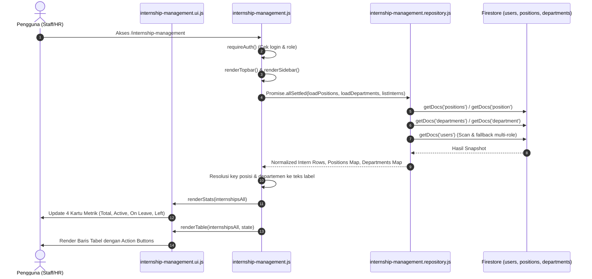
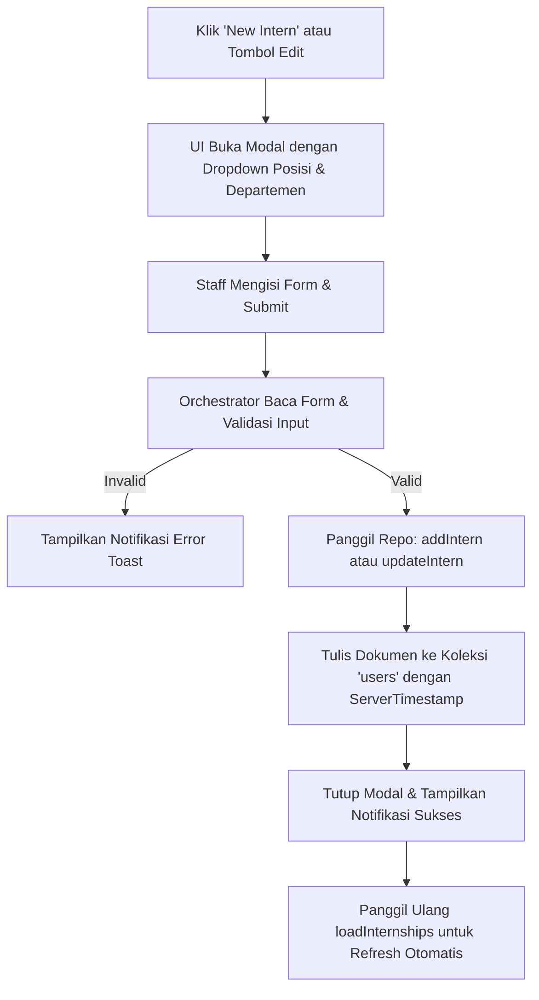
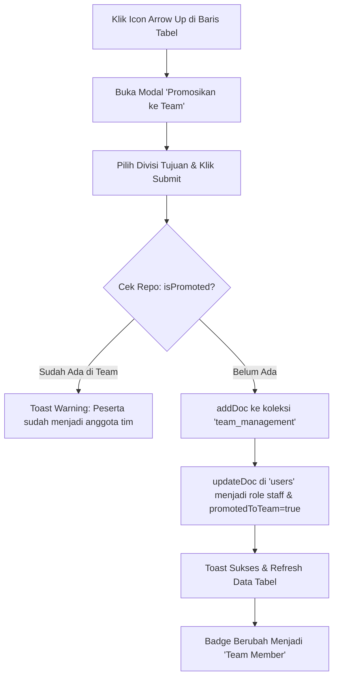

# Workflow & Arsitektur Internship Management

> **Dokumentasi Komprehensif:** Alur Data, Sumber Koleksi Firestore, Operasional CRUD, Promosi Tim, dan Riwayat Migrasi.  
> **Modul:** `pages/hr/internship-management/`  
> **Route Publik:** `/internship-management` (Redirect 301 dari `/internships`)  
> **Branch Terkait:** `refactor/hr/internship-management`

---

## 1. Ringkasan & Tujuan Fitur

**Internship Management** adalah direktori terpusat untuk mengelola seluruh data peserta program magang (intern) di Dialogika. Fitur ini dirancang khusus untuk tim People/HR dengan fungsi utama:
- **Roster & Monitoring Peserta:** Menampilkan daftar peserta magang aktif, izin/cuti (*on leave*), lulus (*graduate*), maupun yang keluar lebih awal (*left*).
- **Statistik & Analisis Tren:** Menghitung total peserta, status aktif, persentase izin, serta laju pertumbuhan peserta baru dalam rentang 3 bulan terakhir.
- **Filter & Quick Search:** Pencarian nama, email, posisi, serta filter interaktif berdasarkan kartu statistik dan jumlah baris per halaman.
- **Manajemen Data (CRUD):** Tambah peserta baru, ubah biodata & penempatan, dan hapus peserta.
- **Promosi ke Tim Inti (*Promote to Team*):** Mengubah status lulusan intern menjadi anggota tim resmi (`staff`) dan mencatatnya ke modul `team_management`.

---

## 2. Sumber Data (Where Data is Taken From)

Modul ini sepenuhnya mengonsumsi Firestore melalui SDK v10.7.1 dengan konfigurasi terpusat di `assets/js/firebase-config.js`.

```
┌─────────────────────────────────────────────────────────────┐
│                    Koleksi Firestore                         │
├──────────────────────┬──────────────────────────────────────┤
│ 1. users             │ Source of truth data peserta intern  │
│ 2. positions         │ Lookup referensi nama posisi/jabatan │
│ 3. departments       │ Lookup referensi divisi/departemen   │
│ 4. team_management   │ Data anggota tim hasil promosi intern│
└──────────────────────┴──────────────────────────────────────┘
```

### A. Koleksi `users` (Sumber Utama)
Seluruh peserta intern disimpan sebagai dokumen di koleksi `users`. Karena Dialogika mengalami evolusi skema (*schema evolution*), sistem mengimplementasikan deteksi multi-koleksi & fallback:

1. **Strategi Deteksi Peserta (`isInternUser`):**
   - Field `role` atau `role_id` bernilai salah satu dari: `internship`, `intern`, `Intern`, `Internship`.
   - Field `access.role_id` bernilai `intern` atau `internship`.
   - Field `employment.role` atau `employment.role_id` bernilai `intern`.
   - Dokumen memiliki properti khas intern seperti `internshipStatus`, `internshipStartDate`, atau `internshipEndDate`.
2. **Struktur Data Dokumen:**
   ```json
   {
     "name": "Nama Peserta",
     "email": "intern@example.com",
     "phone": "081234567890",
     "role": "Internship",
     "role_id": "intern",
     "status": "Active",
     "internshipStatus": "Active",
     "internshipStartDate": "2026-01-01T00:00:00.000Z",
     "internshipEndDate": "2026-06-30T00:00:00.000Z",
     "position": "pos_content_creator",
     "department": "Creative & Production",
     "mode": "Hybrid",
     "address": "Yogyakarta",
     "birth": "2003-05-12T00:00:00.000Z",
     "campus": "Universitas Gadjah Mada",
     "socials": {
       "instagram": "@username",
       "linkedin": "linkedin.com/in/username"
     },
     "promotedToTeam": false,
     "createdAt": "serverTimestamp()",
     "updatedAt": "serverTimestamp()"
   }
   ```

### B. Koleksi Referensi Lookup (`positions` & `departments`)
Untuk menampilkan label jabatan dan divisi yang manusiawi (bukan ID mentah):
- **Posisi:** Membaca koleksi `positions` (dengan fallback koleksi legacy `position`). Memetakan `doc.id` ➡️ `d.name || d.title || d.label`.
- **Departemen:** Membaca koleksi `departments` (dengan fallback koleksi legacy `department`). Memetakan `doc.id` ➡️ `d.name || d.label || d.department`.

### C. Koleksi `team_management` (Tujuan Promosi)
Ketika peserta dipromosikan melalui modal *Promosikan ke Team*:
- Sistem mengecek apakah peserta sudah terdaftar di `team_management` berdasarkan `userId` atau `internshipId`.
- Jika belum, sistem membuat dokumen baru di `team_management` dengan atribut:
  - `source`: `"internship"`
  - `internshipId`: ID dokumen `users`
  - `userId`: ID dokumen `users`
  - `division`: Divisi tujuan yang dipilih
  - `status`: `"Active"`
  - `startDate`: Tanggal mulai magang yang dikonversi
- Kemudian dokumen `users` peserta diperbarui:
  - `role`: `"staff"`
  - `role_id`: `"staff"`
  - `access.role_id`: `"staff"`
  - `promotedToTeam`: `true`
  - `promotedAt`: `serverTimestamp()`

---

## 3. Diagram Alur Operasional (Workflows)

### A. Alur Membaca & Menampilkan Data (Load & Render Flow)



### B. Alur Penentuan Status Magang (*Status Derivation*)
Status tampilan dihitung dinamis melalui fungsi `getInternshipDisplayStatus(user)`:
1. Jika status eksplisit adalah `inactive` atau `left` ➡️ Label **Left / Inactive** (Merah).
2. Jika status eksplisit adalah `graduate` ➡️ Label **Graduate** (Hijau).
3. Jika terdapat tanggal selesai magang (`endDate`):
   - Selisih hari < 0 (sudah lewat hari ini) ➡️ **Graduate** (Lulus).
   - Selisih hari antara 0 s.d. 20 hari ➡️ **On Leave** (Kuning / Persiapan selesai).
   - Selisih hari > 20 hari ➡️ **Active** (Hijau).

### C. Alur Tambah & Edit Peserta (Create & Update Flow)



### D. Alur Promosi ke Tim Inti (Promote to Team Flow)



---

## 4. Struktur Arsitektur Kode Modul

Modul diatur menggunakan arsitektur **Clean Separation of Concerns** konsisten dengan standar Pilot Dialogika:

```
pages/hr/internship-management/
├── index.html
│   ├── Mount point shell (#dg-topbar-mount, #dg-sidebar-mount)
│   ├── Breadcrumb navigasi HR Division
│   ├── 4 Kartu metrik/statistik
│   ├── Toolbar pencarian & pemilihan baris per halaman
│   ├── Tabel responsif dengan sticky columns (Name & Status)
│   └── 3 Modal Bootstrap: Add Intern, Edit Intern, Promote to Team
│
├── internship-management.css
│   ├── Stylesheet terisolasi khusus fitur internship
│   ├── Menggunakan token desain global (--surface, --border-strong, dll)
│   └── Dukungan Dark Mode dan sticky header/columns
│
├── internship-management.js (Orchestrator)
│   ├── Menjaga state lokal (search, filter status, rowsPerPage, page)
│   ├── Koordinasi antarmuka antara Repository dan UI
│   ├── Event delegation untuk aksi dinamis pada baris tabel
│   └── Menjamin requireAuth sebelum eksekusi modul
│
├── internship-management.repository.js (Data Layer)
│   ├── SATU-SATUNYA file yang berhubungan langsung dengan Firestore/Firebase
│   ├── Normalisasi format tanggal fleksibel (Date, Timestamp, String)
│   ├── Scanning dan query multi-skema pada koleksi users
│   └── Tidak mengandung manipulasi DOM atau styling
│
└── internship-management.ui.js (Presentation Layer)
    ├── Rendering kartu statistik, tren pertumbuhan, dan baris tabel
    ├── Helper format tampilan (badge status, tombol aksi, proteksi XSS escapeHtml)
    └── Pengisian dan pembacaan form modal (Add, Edit, Promote)
```

---

## 5. Riwayat Migrasi & Refaktor (Migration History)

### Fase 1: Halaman Monolitik Warisan (*Legacy*)
- **File Asal:** `setting/internship-management.html`
- **Kondisi:** Monolitik lebih dari 1.500 baris, menggunakan variabel global `window.db`, script campur aduk dengan DOM, dan tidak memiliki arsitektur terpisah. File ini tetap dipertahankan tanpa diubah (*untouched*) sebagai referensi pembanding.

### Fase 2: Migrasi Awal ke Pilot
- **Lokasi Lama:** `pages/internships/*`
- **Route:** `/internships`
- **Kondisi:** Berhasil dimigrasikan ke arsitektur modular Pilot (5 file). Namun lokasinya berada di root folder `pages/internships/`, terpisah dari kelompok modul HR lainnya.

### Fase 3: Refaktor Standardisasi HR (*Branch: refactor/hr/internship-management*)
Untuk menyeragamkan seluruh modul internal HR:
1. **Penyelarasan Lokasi:**
   - Folder kosong `pages/hr/internship-management/` diisi dengan 5 file lengkap dan terstandarisasi.
   - Folder lama `pages/internships/` dihapus secara bersih dari git tree agar tidak terjadi duplikasi dan ambiguitas kode.
2. **Routing [firebase.json](file:///d:/dialogika%20fix/pilot/firebase.json):**
   - Route `/internship-management` diarahkan ke `/pages/hr/internship-management/index.html`.
   - Route `/internships` diberikan redirect permanen HTTP 301 ke `/internship-management` untuk menjaga kompatibilitas URL lama.
3. **Penyelarasan Navigasi & Breadcrumb:**
   - Breadcrumb internal menampilkan: `Home / HR Division / Internship Management`.
   - Desain dan token tema menyatu dengan modul HR saudara: `users-management`, `performance-appraisal`, dan `office-inventory`.

---

## 6. Referensi & Dependensi Modul

| Modul | Jalur File | Keterangan |
|---|---|---|
| **Firebase Config** | `assets/js/firebase-config.js` | Inisialisasi tunggal Firestore `db` dan `auth` |
| **Auth Guard** | `assets/js/auth-guard.js` | Proteksi rute login melalui `requireAuth()` |
| **Shell Topbar** | `assets/js/components/topbar/topbar.js` | Komponen navigasi atas bersama |
| **Shell Sidebar** | `assets/js/components/sidebar/sidebar.js` | Komponen menu samping terpadu |
| **UI Utilities** | `assets/js/ui.js` | Helper modal, toast alert, dan confirm dialog |
| **General Utilities** | `assets/js/utils.js` | `escapeHtml`, `getMs`, dan formater |
| **Theme & Layout** | `assets/css/theme.css` & `layout.css` | Token variabel warna, dark-mode, dan grid shell |
